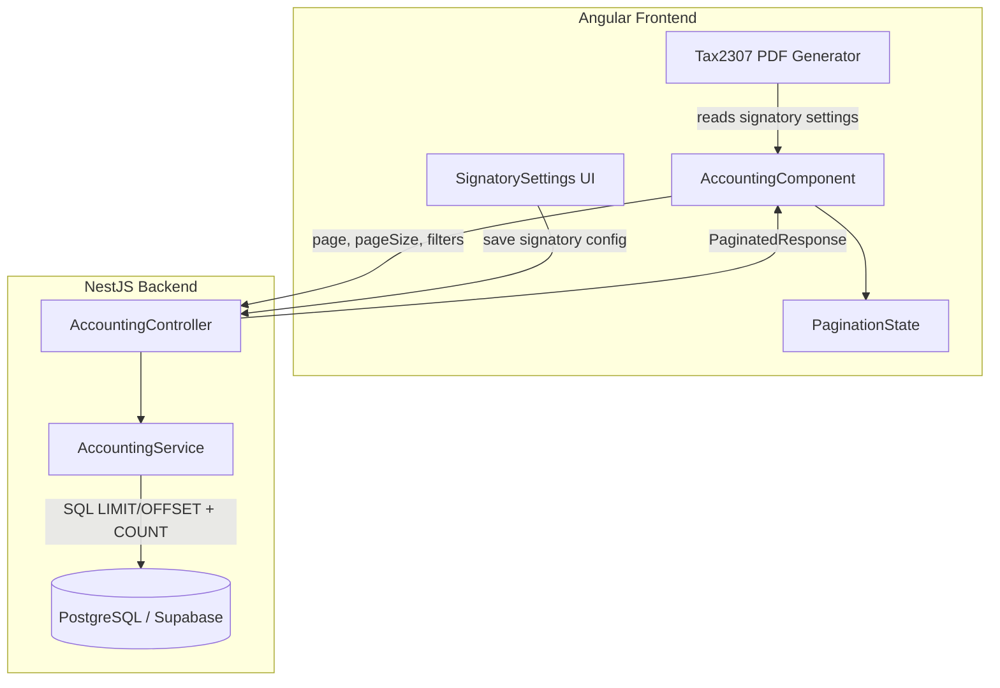

# Design Document: Accounting Pagination & E-Signature

## Overview

This design covers two enhancements to the Accounting Module:

1. **Server-Side Pagination** — Refactoring all accounting report list endpoints to accept `page` and `pageSize` query parameters and return a standardized paginated response envelope. This reduces payload sizes, improves frontend performance, and supports growing datasets.

2. **E-Signature for 2307 Tax Form** — Adding the ability to upload, store, and render an e-signature image (plus signatory metadata) on the BIR 2307 PDF form, enabling compliance with authorized representative identification requirements.

### Design Decisions

- **Pagination is applied at the SQL level** using `LIMIT`/`OFFSET` with a separate `COUNT(*)` query (or window function) to avoid loading full result sets into memory.
- **Standardized response envelope** (`PaginatedResponse<T>`) ensures all endpoints share the same shape, simplifying frontend consumption.
- **E-signature stored as base64 in JSONB** — Since the image is small (max 2 MB) and tightly coupled to print settings, storing it inline in the existing `tblaccounting_report_print_settings.settings_json` column avoids introducing a new table or file storage dependency.
- **Client-side PDF rendering with pdf-lib** is preserved — the signature image is embedded into the PDF at generation time using the base64 data from settings.

## Architecture



### Request Flow — Pagination

1. Frontend sends GET request with `page`, `pageSize`, and existing filter params.
2. Controller parses and validates pagination params (clamp/default).
3. Service builds filtered query, executes `COUNT(*)` for total, then `SELECT ... LIMIT $pageSize OFFSET $offset` for data.
4. Controller wraps result in `PaginatedResponse<T>` envelope and returns.
5. Frontend updates table data and pagination controls from response.

### Request Flow — E-Signature

1. User uploads image file in 2307 Print Settings dialog.
2. Frontend validates file type, size, and dimensions client-side.
3. Frontend converts image to base64 and stores in local signatory config state.
4. On save, frontend sends full settings JSON (including `signatoryImage` base64) to `PUT /accounting/report-print-settings/tax-2307-report`.
5. Backend validates and normalizes signatory fields, stores in `settings_json` JSONB.
6. On PDF generation, frontend reads signatory settings and uses pdf-lib to embed the image and text into the 2307 form.

## Components and Interfaces

### Backend — Pagination Infrastructure

```typescript
// Shared pagination types (new file: backend/src/shared/pagination.types.ts)

export interface PaginationParams {
  page: number;    // >= 1, default 1
  pageSize: number; // 1-200, default 25
}

export interface PaginationMeta {
  page: number;
  pageSize: number;
  total: number;
  totalPages: number;
}

export interface PaginatedResponse<T> {
  data: T[];
  meta: PaginationMeta;
}
```

### Backend — AccountingController Changes

Each list endpoint gains `page` and `pageSize` query parameters:

```typescript
// Updated endpoint signatures
@Get('cheque-vouchers')
async listChequeVouchers(
  @Query('page') page?: string,
  @Query('pageSize') pageSize?: string,
  @Query('dateFrom') dateFrom?: string,
  @Query('dateTo') dateTo?: string,
  @Query('invoice') invoice?: string,
  @Query('particulars') particulars?: string,
  @Query('chequeNo') chequeNo?: string,
): Promise<{ success: boolean; data: PaginatedResponse<ChequeVoucherRecord> }>

@Get('general-journals')
async listGeneralJournals(
  @Query('page') page?: string,
  @Query('pageSize') pageSize?: string,
  @Query('dateFrom') dateFrom?: string,
  @Query('dateTo') dateTo?: string,
): Promise<{ success: boolean; data: PaginatedResponse<GeneralJournalRecord> }>

@Get('sales-register')
async getSalesRegister(
  @Query('page') page?: string,
  @Query('pageSize') pageSize?: string,
  @Query('dateFrom') dateFrom?: string,
  @Query('dateTo') dateTo?: string,
): Promise<{ success: boolean; data: PaginatedResponse<SalesRegisterRow> }>

@Get('tax-2307-report')
async getTax2307Report(
  @Query('page') page?: string,
  @Query('pageSize') pageSize?: string,
  @Query('dateFrom') dateFrom?: string,
  @Query('dateTo') dateTo?: string,
): Promise<{ success: boolean; data: PaginatedResponse<Tax2307Row> }>

@Get('disbursement-register')
async getDisbursementRegister(
  @Query('page') page?: string,
  @Query('pageSize') pageSize?: string,
  @Query('dateFrom') dateFrom?: string,
  @Query('dateTo') dateTo?: string,
): Promise<{ success: boolean; data: PaginatedResponse<DisbursementRow> }>

@Get('weekly-sales')
async getWeeklySales(
  @Query('page') page?: string,
  @Query('pageSize') pageSize?: string,
  @Query('dateFrom') dateFrom?: string,
  @Query('dateTo') dateTo?: string,
): Promise<{ success: boolean; data: PaginatedResponse<WeeklySalesRow> }>

@Get('daily-unit-released')
async getDailyUnitReleased(
  @Query('page') page?: string,
  @Query('pageSize') pageSize?: string,
  @Query('dateFrom') dateFrom?: string,
  @Query('dateTo') dateTo?: string,
): Promise<{ success: boolean; data: PaginatedResponse<DailyUnitReleasedRow> }>

@Get('low-stocks')
async getLowStocks(
  @Query('page') page?: string,
  @Query('pageSize') pageSize?: string,
): Promise<{ success: boolean; data: PaginatedResponse<LowStockRow> }>
```

### Backend — AccountingService Pagination Helper

```typescript
// Added to AccountingService
private parsePaginationParams(
  pageInput: unknown,
  pageSizeInput: unknown,
  defaults?: { page?: number; pageSize?: number; maxPageSize?: number },
): PaginationParams {
  const defaultPage = defaults?.page ?? 1;
  const defaultPageSize = defaults?.pageSize ?? 25;
  const maxPageSize = defaults?.maxPageSize ?? 200;

  let page = Number(pageInput);
  if (!Number.isFinite(page) || !Number.isInteger(page) || page < 1) {
    page = defaultPage;
  }

  let pageSize = Number(pageSizeInput);
  if (!Number.isFinite(pageSize) || !Number.isInteger(pageSize)) {
    pageSize = defaultPageSize;
  }
  pageSize = Math.max(1, Math.min(maxPageSize, pageSize));

  return { page, pageSize };
}

private buildPaginationMeta(total: number, page: number, pageSize: number): PaginationMeta {
  const totalPages = total === 0 ? 0 : Math.ceil(total / pageSize);
  return { page, pageSize, total, totalPages };
}
```

### Backend — E-Signature Settings Extension

```typescript
// Extended Tax2307PrintSettings fields in normalizeReportPrintSettings
interface Tax2307SignatorySettings {
  signatoryName: string;      // max 200 chars
  signatoryTitle: string;     // max 200 chars
  signatoryTin: string;       // max 20 chars
  signatoryImage: string;     // base64 or empty string, max 500000 chars
}
```

The `normalizeReportPrintSettings` method is extended to handle these fields:
- Trim whitespace from text fields
- Truncate to max lengths
- Validate `signatoryImage` is valid base64 (or default to empty string)
- Default missing fields to empty strings

### Frontend — Pagination State

```typescript
// Added to AccountingComponent
interface PaginationState {
  page: number;
  pageSize: number;
  total: number;
  totalPages: number;
}

// Per-report pagination state
chequeVoucherPagination: PaginationState = { page: 1, pageSize: 25, total: 0, totalPages: 0 };
generalJournalPagination: PaginationState = { page: 1, pageSize: 25, total: 0, totalPages: 0 };
salesRegisterPagination: PaginationState = { page: 1, pageSize: 25, total: 0, totalPages: 0 };
tax2307Pagination: PaginationState = { page: 1, pageSize: 25, total: 0, totalPages: 0 };
disbursementPagination: PaginationState = { page: 1, pageSize: 25, total: 0, totalPages: 0 };
weeklySalesPagination: PaginationState = { page: 1, pageSize: 25, total: 0, totalPages: 0 };
dailyUnitReleasedPagination: PaginationState = { page: 1, pageSize: 25, total: 0, totalPages: 0 };
lowStocksPagination: PaginationState = { page: 1, pageSize: 25, total: 0, totalPages: 0 };

pageSizeOptions = [10, 25, 50, 100];
```

### Frontend — Signatory Configuration UI

```typescript
// Extended Tax2307PrintSettings interface
interface Tax2307PrintSettings {
  // ... existing fields ...
  signatoryName: string;
  signatoryTitle: string;
  signatoryTin: string;
  signatoryImage: string; // base64
}

// Signatory section state
signatoryImagePreview: string | null = null;
signatoryUploadError: string = '';
```

### Frontend — PDF Signatory Block Rendering

```typescript
// In the 2307 PDF generation method using pdf-lib
async renderSignatoryBlock(page: PDFPage, settings: Tax2307PrintSettings): Promise<void> {
  const hasSignatory = !!(
    settings.signatoryName?.trim() ||
    settings.signatoryTitle?.trim() ||
    settings.signatoryTin?.trim() ||
    settings.signatoryImage
  );

  if (!hasSignatory) return;

  // Render declaration text
  // Render signature image (if valid base64 PNG/JPEG, scaled to max 150x60)
  // Render printed name
  // Render label
  // Render title/designation and TIN
  // Render subtitle
}
```

## Data Models

### Existing Table: `tblaccounting_report_print_settings`

No schema changes needed. The `settings_json` JSONB column is extended with new keys for the `tax-2307-report` report key:

```json
{
  "showHeader": true,
  "showLogo": true,
  "showAddress": true,
  "paperSize": "A4",
  "orientation": "portrait",
  "signatoryName": "Juan Dela Cruz",
  "signatoryTitle": "Authorized Representative",
  "signatoryTin": "123-456-789-000",
  "signatoryImage": "data:image/png;base64,iVBORw0KGgo..."
}
```

### Pagination Query Pattern

For each paginated endpoint, the SQL follows this pattern:

```sql
-- Count query (executed first)
SELECT COUNT(*) AS total
FROM <table>
WHERE <filters>;

-- Data query (executed second)
SELECT <columns>
FROM <table>
WHERE <filters>
ORDER BY <deterministic_order>
LIMIT $pageSize
OFFSET ($page - 1) * $pageSize;
```

For endpoints with child records (cheque vouchers with deposits/invoices/account titles, general journals with lines), the pagination applies to the parent records only. Child records are fetched in a second query using `WHERE parent_id = ANY($1::bigint[])` on the paginated parent IDs.

### Response Envelope Shape

```json
{
  "success": true,
  "data": {
    "data": [/* rows */],
    "meta": {
      "page": 1,
      "pageSize": 25,
      "total": 142,
      "totalPages": 6
    }
  }
}
```

## Correctness Properties

*A property is a characteristic or behavior that should hold true across all valid executions of a system — essentially, a formal statement about what the system should do. Properties serve as the bridge between human-readable specifications and machine-verifiable correctness guarantees.*

### Property 1: Pagination Slice Correctness

*For any* dataset of N records, any valid page P (≥ 1), and any valid pageSize S (1–200), the returned data array SHALL contain at most S items, and the items SHALL correspond to the records at offset (P-1)*S through min(P*S, N)-1 in the deterministically ordered full result set.

**Validates: Requirements 1.1, 1.8, 2.1, 3.1, 4.1, 5.1, 6.1, 7.1, 7.2, 7.3**

### Property 2: Pagination Metadata Correctness

*For any* total record count T and pageSize S, the returned `totalPages` SHALL equal `Math.ceil(T / S)` when T > 0, and 0 when T = 0. The returned `page` SHALL equal the requested page, and `total` SHALL equal the count of all records matching the applied filters.

**Validates: Requirements 1.3, 1.4**

### Property 3: PageSize Clamping

*For any* numeric pageSize value V, the effective pageSize used by the system SHALL equal `Math.max(1, Math.min(maxPageSize, V))` where maxPageSize is the endpoint's configured maximum (200 for most endpoints, 100 for cheque vouchers).

**Validates: Requirements 1.5, 7.5**

### Property 4: Deterministic Sort Order Across Pages

*For any* filter criteria and two consecutive pages P and P+1, the last item on page P SHALL precede (in sort order) the first item on page P+1, and requesting the same page twice with identical filters SHALL return identical results.

**Validates: Requirements 1.7, 2.1, 6.2**

### Property 5: Date Filter Applied Before Pagination

*For any* date range [dateFrom, dateTo] and any page of results, every record in the returned data array SHALL have its date field within the inclusive range [dateFrom, dateTo].

**Validates: Requirements 3.2, 4.3, 5.3, 6.2, 7.6**

### Property 6: Sales Register Status Invariant

*For any* page of sales register results, every record SHALL have a status of "remitted" or "completed" and a non-null release date.

**Validates: Requirements 4.4**

### Property 7: 2307 Data Derivation

*For any* record in the 2307 tax report response, there SHALL exist a corresponding released cheque voucher with at least one account title whose description contains "expanded withholding tax" or "2307" (case-insensitive).

**Validates: Requirements 5.5**

### Property 8: Frontend Pagination Button State

*For any* pagination state with page P and totalPages T: the "first" and "previous" buttons SHALL be disabled if and only if P = 1; the "next" and "last" buttons SHALL be disabled if and only if P ≥ T.

**Validates: Requirements 8.5, 8.6**

### Property 9: E-Signature File Validation

*For any* uploaded file, the system SHALL accept it if and only if: (a) the content type is PNG or JPEG, AND (b) the file size is ≤ 2 MB, AND (c) the image dimensions are within [100×50, 600×300] pixels. All other files SHALL be rejected with an appropriate error message.

**Validates: Requirements 9.1, 9.5, 9.6, 9.7**

### Property 10: Signatory Settings Round-Trip

*For any* valid signatory configuration (name ≤ 200 chars, title ≤ 200 chars, TIN ≤ 20 chars, image as valid base64), saving the settings and then loading them SHALL return values equal to the trimmed and truncated input values.

**Validates: Requirements 9.2, 9.3, 12.1**

### Property 11: Signatory Block Rendering Presence

*For any* signatory configuration where at least one of (signatoryName, signatoryTitle, signatoryTin) is non-empty OR signatoryImage is non-empty, the generated 2307 PDF SHALL contain the Signatory_Block with the declaration text, printed name, title/designation, and TIN.

**Validates: Requirements 11.1, 11.2, 11.4, 11.6**

### Property 12: Signatory Block Omission

*For any* signatory configuration where all text fields (signatoryName, signatoryTitle, signatoryTin) are empty AND signatoryImage is empty, the generated 2307 PDF SHALL NOT contain a Signatory_Block.

**Validates: Requirements 11.8**

### Property 13: Signature Image Aspect-Ratio Scaling

*For any* image with dimensions W×H, when rendered in the Signatory_Block, the scaled dimensions W'×H' SHALL satisfy: W' ≤ 150, H' ≤ 60, and W'/H' = W/H (aspect ratio preserved within floating-point tolerance).

**Validates: Requirements 11.3**

### Property 14: Settings Normalization

*For any* signatory settings payload, the stored values SHALL have leading/trailing whitespace removed from text fields, text fields truncated to their maximum lengths, and signatoryImage defaulted to empty string if it is not valid base64.

**Validates: Requirements 12.2, 12.3, 12.4**

## Error Handling

### Pagination Errors

| Scenario | Behavior |
|----------|----------|
| `page` is non-numeric/non-integer | Default to page 1 (most endpoints) or return 400 error (cheque vouchers) |
| `pageSize` is non-numeric/non-integer | Default to endpoint's default pageSize |
| `pageSize` out of range | Clamp to [1, maxPageSize] |
| `page` exceeds totalPages | Return empty `data` array with correct `meta.total` |
| Database query fails | Return 500 with generic error message |
| Request timeout (frontend, 30s) | Show error message, retain previous data |

### E-Signature Errors

| Scenario | Behavior |
|----------|----------|
| File is not PNG/JPEG | Reject with "Accepted formats are PNG and JPEG only" |
| File exceeds 2 MB | Reject with "Maximum allowed file size is 2 MB" |
| Image dimensions out of range | Reject with "Allowed dimensions: 100×50 to 600×300 pixels" |
| Invalid base64 in signatoryImage | Default to empty string on save |
| Print settings service unreachable | Frontend falls back to localStorage |
| Invalid image during PDF generation | Render signatory block without image |

## Testing Strategy

### Property-Based Tests (Backend)

Property-based testing is appropriate for this feature because the pagination logic involves pure functions with clear input/output behavior and universal properties that hold across a wide input space.

**Library:** [fast-check](https://github.com/dubzzz/fast-check) (TypeScript PBT library)

**Configuration:** Minimum 100 iterations per property test.

**Tag format:** `Feature: accounting-pagination-esignature, Property {number}: {property_text}`

Tests to implement:
- **Property 1:** Generate random arrays of records (0–500 items), random page/pageSize values. Verify the returned slice matches the expected offset/limit.
- **Property 2:** Generate random totals and pageSizes. Verify totalPages calculation.
- **Property 3:** Generate random numeric values (including negatives, zero, very large). Verify clamping.
- **Property 4:** Generate random datasets, request consecutive pages, verify ordering continuity.
- **Property 5:** Generate random date ranges and records with various dates. Verify all returned records fall within range.
- **Property 6:** Generate random sales data with mixed statuses. Verify only valid statuses appear in results.
- **Property 9:** Generate random file metadata (type, size, dimensions). Verify acceptance/rejection logic.
- **Property 10:** Generate random valid signatory configs. Save and retrieve, verify round-trip.
- **Property 13:** Generate random image dimensions. Verify scaled output fits within 150×60 preserving aspect ratio.
- **Property 14:** Generate random strings with whitespace/long lengths. Verify normalization.

### Unit Tests (Backend)

- Pagination param parsing with specific edge cases (empty string, "abc", "0", "-1", "1.5")
- Default date range application when params omitted
- Cheque voucher endpoint returns 400 for invalid page/pageSize
- Signatory field defaults when absent from payload
- Base64 validation for signatoryImage

### Unit Tests (Frontend)

- Pagination button disabled states for page=1, page=totalPages, page in middle
- Page reset to 1 on filter change
- File validation (type, size, dimensions) before upload
- Signatory preview display/removal
- LocalStorage fallback when API unreachable

### Integration Tests

- Full request/response cycle for each paginated endpoint
- Save and load signatory settings via API
- PDF generation with and without signatory block

### E2E Tests (Manual)

- Navigate through pages on each report table
- Change page size and verify correct data loads
- Upload signature image, save settings, generate PDF, verify signature appears
- Remove signature, regenerate PDF, verify signature absent
