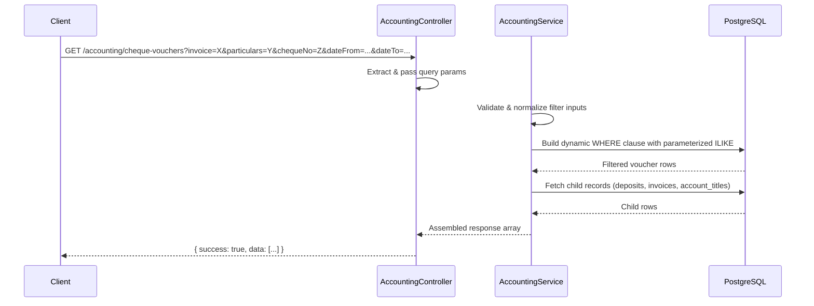
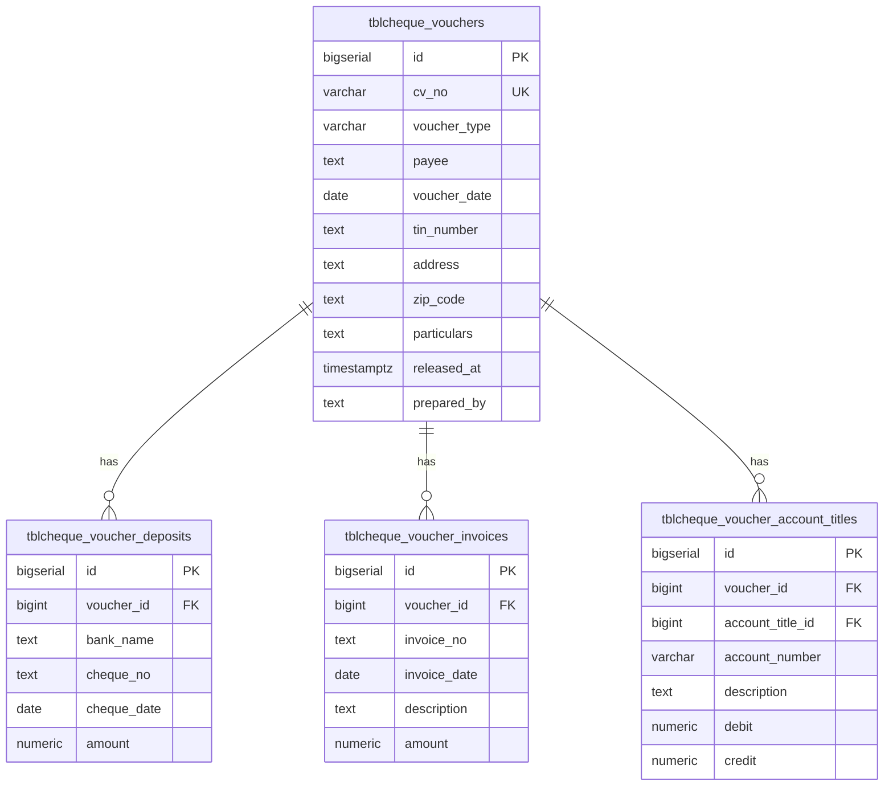

# Design Document: Cheque Voucher Search Filter

## Overview

This design extends the existing `GET /accounting/cheque-vouchers` endpoint in the NestJS accounting module to support text-based search filters for invoice number, particulars, and cheque number. The implementation adds query parameter parsing, input validation, and SQL query modification to the existing `listChequeVouchers` method while preserving the current response structure and date-range filtering behavior.

The approach uses PostgreSQL `ILIKE` for case-insensitive partial matching and leverages `EXISTS` subqueries for child-table filters (invoice, cheque number) to avoid duplicating parent rows in the result set.

## Architecture

The feature modifies the existing accounting module's vertical slice without introducing new modules or services. The data flow is:



**Design Decision:** Filters are applied at the SQL level using `EXISTS` subqueries rather than post-fetch filtering in application code. This ensures pagination-ready performance and avoids loading unnecessary data into memory.

## Components and Interfaces

### Modified: AccountingController

The controller's `listChequeVouchers` method gains three new `@Query()` parameters:

```typescript
@Get('cheque-vouchers')
async listChequeVouchers(
  @Query('dateFrom') dateFrom?: string,
  @Query('dateTo') dateTo?: string,
  @Query('invoice') invoice?: string,
  @Query('particulars') particulars?: string,
  @Query('chequeNo') chequeNo?: string,
): Promise<{ success: boolean; data: unknown }>
```

The controller passes all parameters to the service without transformation.

### Modified: AccountingService.listChequeVouchers

The service method signature changes to accept the new filter parameters:

```typescript
async listChequeVouchers(filters: {
  dateFrom?: string;
  dateTo?: string;
  invoice?: string;
  particulars?: string;
  chequeNo?: string;
}): Promise<Array<ChequeVoucherRow & { deposits: ...; invoices: ...; accountTitles: ... }>>
```

### New: Filter Normalization Logic

A private helper method normalizes text filter inputs:

```typescript
private normalizeTextFilter(value: unknown, maxLength: number): string | null
```

- Trims whitespace
- Returns `null` if result is empty (whitespace-only input)
- Truncates to `maxLength` characters (for invoice: 100 chars)
- Throws `BadRequestException` if exceeds hard limit (for particulars: 500, chequeNo: 50)

**Design Decision:** Invoice uses truncation (soft limit) per requirement 1.4, while particulars and chequeNo use rejection (hard limit) per requirements 2.5 and 3.5. This distinction is handled by a `mode` parameter or separate validation paths.

### New: Dynamic SQL Builder

The existing static SQL query is replaced with a dynamic query builder that conditionally appends WHERE clauses:

```typescript
private buildChequeVoucherFilterQuery(filters: {
  dateFrom: string | null;
  dateTo: string | null;
  invoice: string | null;
  particulars: string | null;
  chequeNo: string | null;
}): { text: string; params: unknown[] }
```

This method constructs parameterized SQL with:
- Date range conditions (existing behavior preserved)
- `ILIKE` condition on `tblcheque_vouchers.particulars` for particulars filter
- `EXISTS` subquery on `tblcheque_voucher_invoices` for invoice filter
- `EXISTS` subquery on `tblcheque_voucher_deposits` for chequeNo filter

## Data Models

### Database Tables (Existing - No Changes)



### SQL Query Structure

The enhanced query uses conditional `EXISTS` subqueries for child-table filters:

```sql
SELECT id, cv_no AS "cvNo", ...
FROM tblcheque_vouchers
WHERE ($1::date IS NULL OR voucher_date >= $1::date)
  AND ($2::date IS NULL OR voucher_date <= $2::date)
  AND ($3::text IS NULL OR particulars ILIKE '%' || $3 || '%')
  AND ($4::text IS NULL OR EXISTS (
    SELECT 1 FROM tblcheque_voucher_invoices
    WHERE voucher_id = tblcheque_vouchers.id
      AND invoice_no ILIKE '%' || $4 || '%'
  ))
  AND ($5::text IS NULL OR EXISTS (
    SELECT 1 FROM tblcheque_voucher_deposits
    WHERE voucher_id = tblcheque_vouchers.id
      AND cheque_no ILIKE '%' || $5 || '%'
  ))
ORDER BY voucher_date DESC, id DESC
```

**Design Decision:** Using `EXISTS` subqueries instead of `JOIN` avoids row duplication when a voucher has multiple matching child records. This preserves the 1:1 relationship between voucher rows in the result set.

### Performance Considerations

- The existing index `idx_tblcheque_voucher_invoices_voucher_id` and `idx_tblcheque_voucher_deposits_voucher_id` support the `EXISTS` subqueries efficiently.
- `ILIKE` with leading wildcard (`%term%`) cannot use B-tree indexes. For the current data volume this is acceptable. If performance degrades, `pg_trgm` GIN indexes can be added later.
- The `$N::text IS NULL` pattern allows PostgreSQL to short-circuit unused filter conditions.

## Correctness Properties

*A property is a characteristic or behavior that should hold true across all valid executions of a system—essentially, a formal statement about what the system should do. Properties serve as the bridge between human-readable specifications and machine-verifiable correctness guarantees.*

### Property 1: Text filter correctness

*For any* non-empty, trimmed filter value and any set of cheque vouchers, every voucher in the filtered result set must satisfy the filter condition: for `invoice`, at least one associated invoice's `invoice_no` contains the search term (case-insensitive); for `particulars`, the voucher's `particulars` field contains the search term (case-insensitive); for `chequeNo`, at least one associated deposit's `cheque_no` contains the search term (case-insensitive).

**Validates: Requirements 1.1, 2.1, 3.1**

### Property 2: Whitespace normalization

*For any* filter parameter value composed entirely of whitespace characters (including empty string), the filtering function shall treat it identically to the parameter being absent—returning the same result set as if the parameter were not provided.

**Validates: Requirements 1.2, 2.2, 3.2, 4.4**

### Property 3: Combined AND logic

*For any* combination of active (non-empty, normalized) filter parameters, every voucher in the result set must satisfy ALL active filters simultaneously. Equivalently, the result set is the intersection of the individual filter result sets.

**Validates: Requirements 4.1, 4.2, 2.4, 3.4**

### Property 4: Input length enforcement

*For any* `particulars` filter value exceeding 500 characters, the API shall reject the request. *For any* `chequeNo` filter value exceeding 50 characters, the API shall reject the request. *For any* `invoice` filter value exceeding 100 characters, the API shall use only the first 100 characters for matching.

**Validates: Requirements 1.4, 2.5, 3.5**

### Property 5: Response completeness

*For any* voucher that appears in the filtered result set, the response shall include the complete set of associated deposits, invoices, and account titles (ordered by id ASC), and shall contain all required fields (cvNo, voucherType, payee, voucherDate, tinNumber, address, zipCode, particulars, releasedAt, preparedBy, deposits, invoices, accountTitles).

**Validates: Requirements 5.1, 5.5**

### Property 6: Sort order preservation

*For any* filtered result set containing two or more vouchers, the vouchers shall be ordered by `voucherDate` descending, with ties broken by `id` descending.

**Validates: Requirements 5.2**

## Error Handling

| Scenario | Response | HTTP Status |
|----------|----------|-------------|
| `particulars` exceeds 500 characters | `{ success: false, message: "Particulars filter exceeds maximum length of 500 characters" }` | 400 |
| `chequeNo` exceeds 50 characters | `{ success: false, message: "Cheque number filter exceeds maximum length of 50 characters" }` | 400 |
| Invalid date format in `dateFrom`/`dateTo` | Treated as null (existing behavior preserved) | 200 |
| Database connection error | NestJS default error handling | 500 |
| No matching results | `{ success: true, data: [] }` | 200 |

The validation occurs early in the service method before any database queries are executed. The existing `BadRequestException` pattern used throughout the accounting service is reused.

## Testing Strategy

### Property-Based Tests

The feature is well-suited for property-based testing because the filtering logic is a pure function of inputs (filter parameters + voucher data) with clear universal properties.

**Library:** [fast-check](https://github.com/dubzzz/fast-check) (JavaScript/TypeScript PBT library compatible with Jest)

**Configuration:**
- Minimum 100 iterations per property test
- Each test tagged with: `Feature: cheque-voucher-search-filter, Property {N}: {description}`

**Test approach:** Extract the filter logic into a pure, testable function that operates on in-memory voucher arrays. This allows property tests to run without database dependencies while validating the core filtering correctness. Integration tests separately verify the SQL query produces equivalent results.

### Unit Tests (Example-Based)

- Verify default date range is applied when no dates provided (Requirement 5.3)
- Verify response envelope structure `{ success: true, data: [...] }` (Requirement 5.4)
- Verify `normalizeTextFilter` helper with specific edge cases (null, undefined, single space, tab characters)
- Verify SQL parameter binding produces correct query for each filter combination

### Integration Tests

- End-to-end test with seeded database: apply invoice filter, verify correct vouchers returned
- End-to-end test: combine all three filters with date range, verify AND logic
- End-to-end test: verify child records are complete for matched vouchers
- Performance smoke test: verify query completes within acceptable time with realistic data volume
