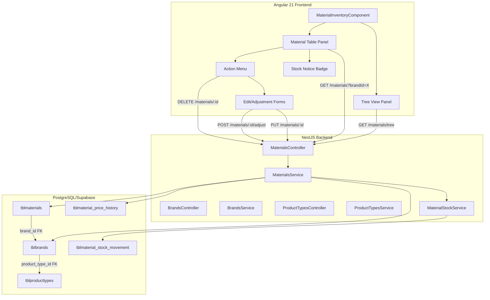
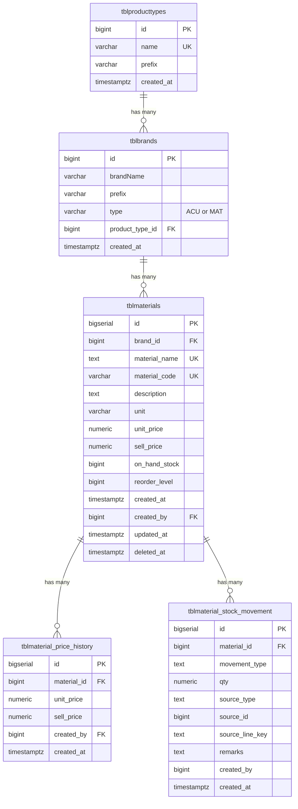

# Design Document: Inventory Tree View Fix

## Overview

This design addresses a bug fix and UI enhancement for the Material Inventory module in the 3BMA HVAC Management System. The current implementation incorrectly persists material data to `tblproducts` with ACU-type brands. This design corrects the data persistence layer to use `tblmaterials` with MAT-type brands, introduces a hierarchical tree view (Product Type → Brand), and adds a material data table with action menus, stock indicators, and stock deficit recording.

### Key Design Decisions

1. **Schema Migration**: Add `product_type_id` foreign key to `tblbrands` to establish the Product Type → Brand hierarchy
2. **Tree View Data Structure**: Build the tree on the backend via a dedicated endpoint that returns a nested structure, reducing frontend complexity
3. **Reuse Existing Services**: Leverage the existing `MaterialsService`, `BrandsService`, and `MaterialStockService` rather than creating new services
4. **Frontend Component**: Create a new `material-inventory` page component (the empty directory already exists) with a split-panel layout (tree left, table right)
5. **Calculation Logic**: Keep computed columns (Margin, Overall Cost, etc.) as frontend-only calculations to avoid schema changes

## Architecture



## Components and Interfaces

### Backend API Endpoints

#### 1. Tree View Endpoint (New)

```typescript
// GET /materials/tree
// Returns hierarchical tree structure for the left panel
interface TreeResponse {
  success: boolean;
  tree: ProductTypeNode[];
}

interface ProductTypeNode {
  id: number | null;       // null for "Uncategorized"
  name: string;
  type: 'product-type';
  children: BrandNode[];
}

interface BrandNode {
  id: number;
  name: string;
  type: 'brand';
  prefix: string;
}
```

#### 2. Materials by Brand Endpoint (Existing, enhanced)

```typescript
// GET /materials?brandId=123&search=term
// Returns materials filtered by brand, sorted alphabetically
interface MaterialListResponse {
  success: boolean;
  items: MaterialRow[];
}

interface MaterialRow {
  id: number;
  material_code: string | null;
  material_name: string;
  unit: string;
  unit_price: number;
  sell_price: number;
  on_hand_stock: number;
  reorder_level: number;
  brand_id: number | null;
  brand_name: string | null;
}
```

#### 3. Stock Adjustment Endpoint (New)

```typescript
// POST /materials/:id/adjust
interface StockAdjustmentDto {
  direction: 'increase' | 'decrease';
  quantity: number;       // 1 to 999999
  remarks?: string;       // max 500 chars
}

interface StockAdjustmentResponse {
  success: boolean;
  message: string;
  material: MaterialRow;
}
```

#### 4. Material History Endpoint (New)

```typescript
// GET /materials/:id/history
interface MaterialHistoryResponse {
  success: boolean;
  priceHistory: PriceHistoryRecord[];
  stockMovements: StockMovementRecord[];
}

interface PriceHistoryRecord {
  id: number;
  unit_price: number;
  sell_price: number;
  created_by: number | null;
  created_at: string;
}

interface StockMovementRecord {
  id: number;
  movement_type: string;
  qty: number;
  source_type: string;
  source_id: number;
  source_line_key: string;
  remarks: string | null;
  created_by: number | null;
  created_at: string;
}
```

#### 5. Stock Deficit Recording (Enhancement to existing SO flow)

```typescript
// Called internally when a sales order line item exceeds available stock
interface StockDeficitParams {
  materialId: number;
  orderedQty: number;
  onHandStock: number;
  salesOrderId: number;
  lineItemKey: string;
  userId: number;
}
```

### Frontend Components

#### MaterialInventoryComponent (New Page)

- **Layout**: Split panel — 30% left (tree), 70% right (table)
- **Tree Panel**: Uses a custom tree built with Tailwind CSS (no PrimeNG in this project)
  - Expandable/collapsible nodes with folder icons
  - Search input at the top with debounced filtering
  - Product Type nodes as parents, Brand nodes as children
- **Table Panel**: Custom table with Tailwind styling
  - Displays material data with computed columns
  - Stock notice badges (colored badges using Tailwind classes)
  - Three-dot action menu per row

#### Tree Filtering Logic (Frontend)

```typescript
interface TreeFilterResult {
  filteredTree: ProductTypeNode[];
  expandedNodeIds: Set<number | null>;
}

function filterTree(
  tree: ProductTypeNode[],
  searchTerm: string
): TreeFilterResult;
```

#### Stock Notice Classification (Frontend)

```typescript
type StockStatus = 'normal' | 'low-stock' | 'out-of-stock';

function getStockStatus(onHandStock: number, reorderLevel: number): StockStatus;
```

#### Material Table Calculations (Frontend)

```typescript
interface ComputedMaterialRow extends MaterialRow {
  margin: number;           // sell_price - unit_price
  overallCost: number;      // unit_price * on_hand_stock
  overallPrice: number;     // sell_price * on_hand_stock
  overallMargin: number;    // overallPrice - overallCost
}

function computeMaterialRow(material: MaterialRow): ComputedMaterialRow;
```

## Data Models

### Schema Migration: Add `product_type_id` to `tblbrands`

```sql
-- Add product_type_id column to tblbrands
ALTER TABLE public.tblbrands
  ADD COLUMN IF NOT EXISTS product_type_id BIGINT NULL
    REFERENCES public.tblproducttypes(id) ON UPDATE CASCADE ON DELETE SET NULL;

CREATE INDEX IF NOT EXISTS idx_tblbrands_product_type_id
  ON public.tblbrands(product_type_id);

COMMENT ON COLUMN public.tblbrands.product_type_id IS
  'FK to tblproducttypes; groups MAT brands under product type categories in the tree view';
```

### Entity Relationships



### Tree View Query

```sql
-- Fetch tree structure: Product Types with their MAT brands
SELECT
  pt.id AS product_type_id,
  pt.name AS product_type_name,
  b.id AS brand_id,
  b."brandName" AS brand_name,
  b.prefix AS brand_prefix
FROM tblproducttypes pt
LEFT JOIN tblbrands b ON b.product_type_id = pt.id AND b.type = 'MAT'
ORDER BY pt.name ASC, b."brandName" ASC;

-- Uncategorized brands (no product_type_id)
SELECT
  b.id AS brand_id,
  b."brandName" AS brand_name,
  b.prefix AS brand_prefix
FROM tblbrands b
WHERE b.type = 'MAT' AND b.product_type_id IS NULL
ORDER BY b."brandName" ASC;
```

## Correctness Properties

*A property is a characteristic or behavior that should hold true across all valid executions of a system — essentially, a formal statement about what the system should do. Properties serve as the bridge between human-readable specifications and machine-verifiable correctness guarantees.*

### Property 1: MAT-brand filter completeness

*For any* set of brands in the database with mixed types (ACU and MAT), the `getMaterialBrands()` function SHALL return only brands where `type = 'MAT'`, and SHALL return all such brands.

**Validates: Requirements 1.3**

### Property 2: Duplicate material name rejection

*For any* material name that already exists in `tblmaterials` (among non-deleted records), attempting to create a new material with the same name SHALL be rejected with an error.

**Validates: Requirements 1.6**

### Property 3: Material persistence target invariant

*For any* material creation operation through the Inventory Module, the operation SHALL insert exactly one row into `tblmaterials` and zero rows into `tblproducts`.

**Validates: Requirements 1.1, 1.7**

### Property 4: Tree structure completeness and ordering

*For any* set of product types and MAT-type brands with `product_type_id` associations, the tree view data structure SHALL contain all product types as parent nodes in ascending alphabetical order, with each product type's children being its associated MAT brands in ascending alphabetical order.

**Validates: Requirements 2.1, 2.2, 2.5, 2.6**

### Property 5: Tree search filter correctness

*For any* tree dataset and non-empty search term, the filtered tree SHALL contain only nodes (product types or brands) whose names contain the search term as a case-insensitive substring, plus any parent product type nodes that have matching brand children.

**Validates: Requirements 2.4**

### Property 6: Material table filtering and sorting

*For any* brand with associated materials, selecting that brand SHALL return exactly the materials with that `brand_id` (excluding soft-deleted), sorted by `material_name` in ascending alphabetical order.

**Validates: Requirements 3.1**

### Property 7: Material computed columns correctness

*For any* material with `unit_price`, `sell_price`, and `on_hand_stock` values, the computed columns SHALL satisfy: `margin = sell_price - unit_price`, `overallCost = unit_price * on_hand_stock`, `overallPrice = sell_price * on_hand_stock`, `overallMargin = overallPrice - overallCost`, all rounded to 2 decimal places.

**Validates: Requirements 3.3, 3.4, 3.5, 3.6**

### Property 8: Stock notice classification

*For any* material with `on_hand_stock` and `reorder_level` values, the stock status SHALL be: "Out of Stock" when `on_hand_stock <= 0`, "Low Stock" when `0 < on_hand_stock <= reorder_level`, and "Normal" when `on_hand_stock > reorder_level`.

**Validates: Requirements 3.8, 3.9, 3.10, 5.1, 5.2, 5.3, 5.4**

### Property 9: Stock adjustment recording

*For any* valid stock adjustment (direction in {increase, decrease}, quantity in [1, 999999], remarks length <= 500), the system SHALL record a Stock_Movement with `movement_type = 'ADJUST'` and the correct quantity, and SHALL update `on_hand_stock` accordingly. If a decrease would reduce stock below zero, the adjustment SHALL be rejected.

**Validates: Requirements 4.6, 4.7**

### Property 10: Stock deficit recording with non-negative balance

*For any* sales order where `ordered_qty > on_hand_stock` for a material, the system SHALL record a Stock_Movement with `movement_type = 'OUT'`, `qty = ordered_qty - on_hand_stock`, `source_type = 'SO'`, the correct `source_id` and `source_line_key`, and SHALL NOT reduce `on_hand_stock` below zero.

**Validates: Requirements 6.1, 6.2, 6.3**

## Error Handling

### Backend Error Handling

| Scenario | HTTP Status | Error Response |
|----------|-------------|----------------|
| Brand not found | 404 | `{ message: "Brand with ID X not found" }` |
| Brand type is ACU | 400 | `{ message: "Selected brand is not a material brand. Please select a brand with type MAT." }` |
| Duplicate material name | 400 | `{ message: "Material with name 'X' already exists" }` |
| Material not found | 404 | `{ message: "Material with ID X not found" }` |
| Insufficient stock for adjustment | 400 | `{ message: "Insufficient stock. Available: X, Requested: Y" }` |
| Invalid adjustment quantity | 400 | `{ message: "Quantity must be between 1 and 999999" }` |
| Remarks too long | 400 | `{ message: "Remarks must not exceed 500 characters" }` |

### Frontend Error Handling

- **Network errors**: Display a toast notification with retry option
- **Validation errors**: Display inline error messages below form fields
- **Confirmation dialogs**: Require explicit user confirmation for destructive actions (delete)
- **Loading states**: Show skeleton loaders for tree and table during data fetch
- **Empty states**: Display contextual messages when no data is available

## Testing Strategy

### Property-Based Tests (fast-check)

The project already has `fast-check` (v3.22.0) installed in the frontend. For backend tests, we will add `fast-check` as a dev dependency alongside Jest.

**Configuration:**
- Minimum 100 iterations per property test
- Each property test tagged with: `Feature: inventory-tree-view-fix, Property {number}: {description}`

**Property tests to implement:**
1. MAT-brand filter completeness (backend unit test)
2. Duplicate material name rejection (backend unit test)
3. Material persistence target invariant (backend integration test with mocked DB)
4. Tree structure completeness and ordering (backend unit test)
5. Tree search filter correctness (frontend unit test)
6. Material table filtering and sorting (backend unit test)
7. Material computed columns correctness (frontend unit test)
8. Stock notice classification (frontend unit test)
9. Stock adjustment recording (backend unit test)
10. Stock deficit recording with non-negative balance (backend unit test)

### Unit Tests (Example-Based)

- Material creation without brand_id sets null
- Uncategorized brands appear under "Uncategorized" node
- Tree search clear restores full tree
- Empty brand shows empty state message
- Action menu displays correct options in order
- Delete confirmation dialog shows material name
- Cancel delete leaves material unchanged
- Click outside closes action menu
- History displays records ordered by created_at DESC, limited to 100

### Integration Tests

- Full material CRUD flow through controller
- Tree endpoint returns correct structure from real DB queries
- Stock adjustment updates both movement table and material stock
- Stock deficit recording during sales order processing

### Test Libraries

- **Backend**: Jest + fast-check (add `fast-check` to backend devDependencies)
- **Frontend**: Jasmine + Karma + fast-check (already installed)
