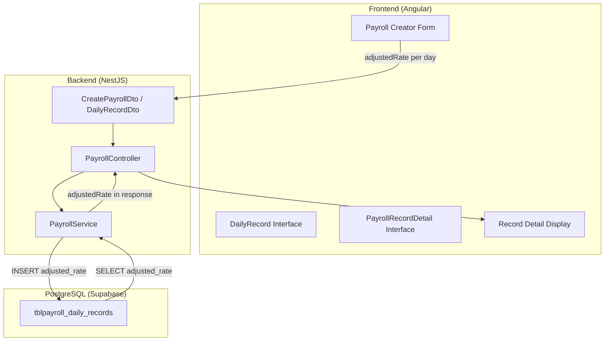

# Design Document: Payroll Adjusted Rate

## Overview

This design integrates the `adjustedRate` field into the payroll module's full stack — from database storage through backend service logic to frontend display and input. The core change replaces the flat `base_salary_used` approach for payout computation with a per-day `adjusted_rate` stored in `tblpayroll_daily_records`. This enables payroll administrators to specify day-specific rates (overtime, holiday, project-specific) while maintaining backward compatibility with existing records.

### Key Design Decisions

1. **Column addition with DEFAULT 0**: Ensures backward compatibility — existing daily records get `adjusted_rate = 0`, and the payout computation for legacy records continues to work via the existing `base_salary_used` field until new records are created with proper adjusted rates.
2. **Frontend initializes adjustedRate to baseSalary**: When generating daily records for a new cutoff, each day starts with the employee's current base salary as the adjusted rate, reducing manual entry for the common case.
3. **Payout formula change**: The net pay formula shifts from using a flat `base_salary_used` to `SUM(adjusted_rate WHERE is_present = true)`, making the computation accurate per-day.

## Architecture



### Data Flow

1. **Create**: User enters adjustedRate per day in Payroll Creator → Frontend sends `adjustedRate` in each daily record → Backend validates and persists to `adjusted_rate` column → Payout computed using SUM of adjusted rates for present days.
2. **Retrieve**: Backend queries `adjusted_rate` from `tblpayroll_daily_records` → Returns `adjustedRate` field in each daily record of the response → Frontend displays in record detail view.

## Components and Interfaces

### Database Migration

**File**: `backend/sql/supabase/20260503_payroll_adjusted_rate.sql`

```sql
BEGIN;

ALTER TABLE public.tblpayroll_daily_records
  ADD COLUMN adjusted_rate NUMERIC(12,2) NOT NULL DEFAULT 0;

ALTER TABLE public.tblpayroll_daily_records
  ADD CONSTRAINT chk_adjusted_rate_non_negative CHECK (adjusted_rate >= 0);

COMMIT;
```

### Backend: DailyRecordDto (Already Done)

The `DailyRecordDto` in `create-payroll.dto.ts` already has:

```typescript
@IsNumber()
@Min(0)
adjustedRate: number;
```

No changes needed to the DTO.

### Backend: PayrollService Changes

**createEmployeePayroll** — Add `adjusted_rate` to the daily records INSERT:

```typescript
// Current columns: payroll_record_id, record_date, is_present, assigned_project_id, commission, remarks
// New columns:     payroll_record_id, record_date, is_present, assigned_project_id, commission, remarks, adjusted_rate
```

Each daily record placeholder expands from 6 to 7 parameters, adding `record.adjustedRate ?? 0`.

**Payout computation change** — Replace flat `baseSalary` with sum of adjusted rates for present days:

```typescript
// OLD: netPay = baseSalary + totalCommissions + totalAdditionalComp - totalAdditionalDed - totalGovDeductions
// NEW:
const totalAdjustedRate = dto.dailyRecords
  .filter(r => r.isPresent)
  .reduce((sum, r) => sum + (r.adjustedRate ?? 0), 0);

const netPay = totalAdjustedRate + totalCommissions + totalAdditionalComp - totalAdditionalDed - totalGovDeductions;
```

**getPayrollRecordDetails** — Query `adjusted_rate` from daily records:

```typescript
// Add to SELECT: dr.adjusted_rate::numeric AS "adjustedRate"
// Replace: pr.base_salary_used::numeric AS "baseRate"
// With:    dr.adjusted_rate::numeric AS "adjustedRate"
```

**computePayout** — Update to use `adjusted_rate` from daily records:

```typescript
// Query adjusted_rate instead of base_salary_used for daily records
// SUM adjusted_rate WHERE is_present = true
```

**getEmployeeCutoffs** — Update payout computation to use adjusted_rate.

### Backend: PayrollController

No changes needed — the controller already passes the DTO through and returns the service response.

### Frontend: Interface Updates

**DailyRecord** — Add `adjustedRate`:

```typescript
export interface DailyRecord {
  date: string;
  isPresent: boolean;
  assignedProjectId: number | null;
  commission: number;
  adjustedRate: number;  // NEW: replaces baseRate
  remarks: string;
}
```

**PayrollRecordDetail.dailyRecords** — Add `adjustedRate`:

```typescript
dailyRecords: Array<{
  date: string;
  isPresent: boolean;
  assignedProjectId: number | null;
  assignedProjectName: string | null;
  commission: number;
  adjustedRate: number;  // NEW: replaces baseRate
  remarks: string;
}>;
```

### Frontend: Payroll Creator Form Changes

**generatePayrollCreatorDays()** — Initialize `adjustedRate` to employee's baseSalary:

```typescript
records.push({
  date: current.toISOString().split('T')[0],
  isPresent: true,
  assignedProjectId: null,
  commission: 0,
  adjustedRate: this.selectedEmployee!.baseSalary,  // Initialize to base salary
  remarks: ''
});
```

**submitPayrollCreator()** — Include `adjustedRate` in the request body:

```typescript
dailyRecords: this.payrollCreatorDailyRecords.map(r => ({
  date: r.date,
  isPresent: r.isPresent,
  assignedProjectId: r.assignedProjectId || null,
  commission: r.commission || 0,
  adjustedRate: r.adjustedRate ?? 0,  // NEW
  remarks: r.remarks || undefined
})),
```

**Template** — Add numeric input for adjustedRate in each daily record tab:

```html
<label>Adjusted Rate</label>
<input type="number" [(ngModel)]="payrollCreatorDailyRecords[payrollCreatorSelectedTab].adjustedRate"
       min="0" step="0.01" />
```

### Frontend: Record Detail Display Changes

**getSubTotalBaseRate()** — Rename and update to sum `adjustedRate` for present days:

```typescript
getSubTotalAdjustedRate(): number {
  if (!this.payrollRecordDetail) return 0;
  const presentDays = this.payrollRecordDetail.dailyRecords.filter(r => r.isPresent);
  return presentDays.reduce((sum, r) => sum + Number(r.adjustedRate ?? 0), 0);
}
```

## Data Models

### tblpayroll_daily_records (Updated)

| Column | Type | Constraints | Description |
|--------|------|-------------|-------------|
| id | BIGSERIAL | PRIMARY KEY | Auto-increment ID |
| payroll_record_id | BIGINT | NOT NULL, FK → tblpayroll_records(id) ON DELETE CASCADE | Parent payroll record |
| record_date | DATE | NOT NULL, UNIQUE(payroll_record_id, record_date) | The date for this record |
| is_present | BOOLEAN | NOT NULL, DEFAULT false | Whether employee was present |
| assigned_project_id | BIGINT | nullable | Project assigned for the day |
| commission | NUMERIC(12,2) | NOT NULL, DEFAULT 0 | Commission earned |
| remarks | TEXT | nullable | Notes for the day |
| **adjusted_rate** | **NUMERIC(12,2)** | **NOT NULL, DEFAULT 0, CHECK >= 0** | **Rate applied for this day** |

### Payout Computation Formula

```
Net Pay = SUM(adjusted_rate WHERE is_present = true)
        + SUM(commission WHERE is_present = true)
        + SUM(additional_compensation.amount)
        - SUM(additional_deductions.amount)
        - (pag_ibig_used + philhealth_used + sss_used)
```

### API Response Shape (GET /payroll/records/:id/details)

```typescript
{
  id: number;
  employeeName: string;
  department: string;
  cutoffStart: string;
  cutoffEnd: string;
  baseSalaryUsed: number;
  payoutAmount: number;  // Computed using new formula
  generatedAt: string;
  dailyRecords: Array<{
    date: string;
    isPresent: boolean;
    assignedProjectId: number | null;
    assignedProjectName: string | null;
    commission: number;
    adjustedRate: number;  // NEW field
    remarks: string;
  }>;
  additionalCompensation: Array<{ description: string; amount: number }>;
  additionalDeductions: Array<{ description: string; amount: number }>;
  governmentDeductions: { pagIbig: number; philhealth: number; sss: number };
}
```

## Correctness Properties

*A property is a characteristic or behavior that should hold true across all valid executions of a system — essentially, a formal statement about what the system should do. Properties serve as the bridge between human-readable specifications and machine-verifiable correctness guarantees.*

### Property 1: Adjusted Rate Persistence Round-Trip

*For any* valid payroll creation request containing daily records with adjustedRate values (each >= 0), persisting the payroll and then retrieving the record details SHALL return the same adjustedRate value for each daily record.

**Validates: Requirements 2.1, 2.4, 3.3, 4.1**

### Property 2: Payout Computation Formula

*For any* set of daily records (with adjustedRate >= 0 and is_present as boolean), additional compensation entries (amount > 0), additional deduction entries (amount > 0), and government deductions (pagIbig >= 0, philhealth >= 0, sss >= 0), the computed net pay SHALL equal: `SUM(adjustedRate WHERE isPresent) + SUM(commission WHERE isPresent) + SUM(additionalCompensation) - SUM(additionalDeductions) - (pagIbig + philhealth + sss)`.

**Validates: Requirements 3.1, 3.2, 4.3**

### Property 3: Daily Record Initialization to Base Salary

*For any* employee with a baseSalary > 0 and any valid cutoff date range, generating daily records SHALL produce records where every `adjustedRate` value equals the employee's current baseSalary.

**Validates: Requirements 5.2, 7.3**

### Property 4: Subtotal Computation Uses Only Present Days

*For any* set of daily records with varying isPresent status and adjustedRate values, the subtotal of adjusted rates SHALL equal the sum of adjustedRate values only from records where isPresent is true, and SHALL be 0 when no records have isPresent set to true.

**Validates: Requirements 3.4, 6.2, 6.3**

### Property 5: Negative Adjusted Rate Rejection

*For any* payroll creation request containing a daily record with adjustedRate < 0, the system SHALL reject the request with a validation error and SHALL NOT persist any records from that request.

**Validates: Requirements 2.3, 5.4**

## Error Handling

| Scenario | Layer | Behavior |
|----------|-------|----------|
| `adjustedRate` is negative in request | Backend DTO validation (`@Min(0)`) | 400 Bad Request with validation error message |
| `adjustedRate` is null/undefined | Backend service | Defaults to `0` during INSERT |
| `adjustedRate` violates DB CHECK constraint | Database | PostgreSQL raises constraint violation (safety net) |
| Non-numeric `adjustedRate` in frontend | Frontend validation | Prevents form submission, shows error |
| Record not found on detail retrieval | Backend service | 404 Not Found |
| Database INSERT fails mid-transaction | Backend service (withTransaction) | Full rollback, 500 Internal Server Error |

## Testing Strategy

### Unit Tests (Example-Based)

- Verify migration adds column with correct type and default
- Verify negative adjustedRate is rejected by DTO validation
- Verify `getPayrollRecordDetails` returns 404 for non-existent record
- Verify frontend form renders adjustedRate input for each daily record
- Verify tab switching retains adjustedRate values

### Property-Based Tests

**Library**: [fast-check](https://github.com/dubzzz/fast-check) (TypeScript PBT library)

**Configuration**: Minimum 100 iterations per property test.

Each property test references its design document property:

- **Feature: payroll-adjusted-rate, Property 1: Adjusted Rate Persistence Round-Trip** — Generate random daily records with valid adjustedRate values, create payroll via service, retrieve details, assert round-trip equality.
- **Feature: payroll-adjusted-rate, Property 2: Payout Computation Formula** — Generate random payroll inputs (daily records, compensation, deductions, gov deductions), compute expected net pay using the formula, assert service produces the same result.
- **Feature: payroll-adjusted-rate, Property 3: Daily Record Initialization to Base Salary** — Generate random employees with various baseSalary values and date ranges, call generatePayrollCreatorDays logic, assert all adjustedRate values equal baseSalary.
- **Feature: payroll-adjusted-rate, Property 4: Subtotal Computation Uses Only Present Days** — Generate random daily records with mixed presence, compute subtotal, assert it equals sum of adjustedRate only where isPresent is true.
- **Feature: payroll-adjusted-rate, Property 5: Negative Adjusted Rate Rejection** — Generate payroll requests with at least one negative adjustedRate, assert validation rejects the request.

### Integration Tests

- End-to-end test: Create payroll with adjustedRate via API, retrieve via detail endpoint, verify response shape and values.
- Verify payout amount in cutoff list reflects adjusted-rate-based computation.
