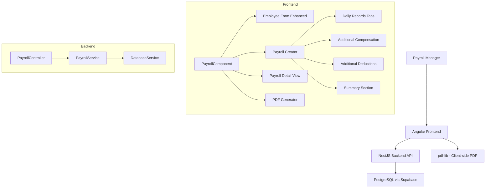
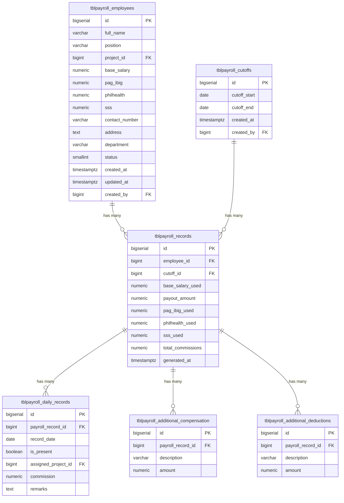

# Design Document: Payroll Enhancement

## Overview

The Payroll Enhancement extends the existing payroll module from a basic batch-cutoff system into a comprehensive per-employee compensation management tool. The enhancement introduces:

1. **Enhanced Employee Data** — Government-mandated deductions (Pag-Ibig, Philhealth, SSS), contact information, address, and department classification.
2. **Per-Employee Payroll Creation** — Replaces the batch cutoff approach with a per-employee workflow featuring daily attendance tracking, project assignments, and commissions.
3. **Additional Compensation/Deductions** — Dynamic arrays of supplementary pay and deduction entries per payroll record.
4. **Payroll Summary Computation** — Real-time net pay calculation incorporating all components.
5. **PDF Payslip Generation** — Client-side PDF generation using pdf-lib with detailed payroll breakdown.
6. **Enhanced Detail View** — Full breakdown of previously generated payroll records including daily records and adjustments.

The design preserves the existing architecture patterns: raw SQL via DatabaseService on the backend, standalone Angular component with template-driven forms on the frontend, and TailwindCSS v4 for styling.

## Architecture

### High-Level Flow



### Design Decisions

1. **Keep single component file** — The frontend remains a single `PayrollComponent` with modals/sections toggled by state flags. This matches the existing pattern and avoids introducing a sub-component architecture that doesn't exist elsewhere in the project.

2. **Replace batch cutoff with per-employee endpoint** — The existing `POST /payroll/cutoffs` with `employeeIds[]` is replaced by `POST /payroll/employees/:id/payroll`. The old endpoint remains for backward compatibility but the UI will use the new one.

3. **Transaction-based persistence** — The new payroll creation endpoint wraps all inserts (cutoff, payroll record, daily records, compensation, deductions) in a single database transaction.

4. **Client-side PDF generation** — pdf-lib (already installed) generates payslips in the browser. No server-side PDF rendering needed, reducing backend complexity and server load.

5. **Government deductions stored at payroll-generation time** — The payroll record captures the Pag-Ibig/Philhealth/SSS values at the time of generation (snapshot), so historical records remain accurate even if employee deduction amounts change later.

6. **Net pay formula** — `net_pay = base_salary + total_commissions + total_additional_compensation - total_additional_deductions - total_government_deductions`. Note: base salary is a fixed amount per cutoff period (not multiplied by days present). Days present is tracked for reporting purposes.

## Components and Interfaces

### Backend Components

#### DTOs (New/Modified)

```typescript
// create-employee.dto.ts (enhanced)
export class CreateEmployeeDto {
  fullName: string;
  position: string;
  projectId?: number;
  baseSalary: number;
  pagIbig?: number;       // defaults to 0
  philhealth?: number;    // defaults to 0
  sss?: number;           // defaults to 0
  contactNumber?: string;
  address?: string;
  department: string;     // required: Driver | Installer | Helper | Office | Project Assigned
}

// update-employee.dto.ts (enhanced)
export class UpdateEmployeeDto {
  fullName?: string;
  position?: string;
  projectId?: number | null;
  baseSalary?: number;
  pagIbig?: number;
  philhealth?: number;
  sss?: number;
  contactNumber?: string;
  address?: string;
  department?: string;
}

// create-payroll.dto.ts (new)
export class CreatePayrollDto {
  cutoffStart: string;    // ISO date string YYYY-MM-DD
  cutoffEnd: string;      // ISO date string YYYY-MM-DD
  dailyRecords: DailyRecordDto[];
  additionalCompensation: CompensationEntryDto[];
  additionalDeductions: DeductionEntryDto[];
}

export class DailyRecordDto {
  date: string;           // ISO date string YYYY-MM-DD
  isPresent: boolean;
  assignedProjectId?: number | null;
  commission: number;     // 0 if not present
  remarks?: string;
}

export class CompensationEntryDto {
  description: string;
  amount: number;         // must be > 0
}

export class DeductionEntryDto {
  description: string;
  amount: number;         // must be > 0
}
```

#### Controller Endpoints (New/Modified)

| Method | Path | Permission | Description |
|--------|------|-----------|-------------|
| POST | `/payroll/employees` | `payroll.employee.create` | Enhanced with new fields |
| PATCH | `/payroll/employees/:id` | `payroll.employee.edit` | Enhanced with new fields |
| GET | `/payroll/employees` | `payroll.view` | Returns enhanced fields |
| POST | `/payroll/employees/:id/payroll` | `payroll.create` | New per-employee payroll creation |
| GET | `/payroll/records/:id/details` | `payroll.cutoff.view` | New detailed payroll record view |

#### Service Methods (New/Modified)

- `createEmployee(dto, userId)` — Enhanced to persist new fields
- `updateEmployee(id, dto)` — Enhanced to update new fields
- `getEmployees(filters)` — Enhanced to return new fields
- `createEmployeePayroll(employeeId, dto, userId)` — New: creates cutoff + record + daily records + compensation + deductions in a transaction
- `getPayrollRecordDetails(recordId)` — New: returns full payroll breakdown with all associated data

### Frontend Components

The `PayrollComponent` gains the following new state sections:

1. **Enhanced Employee Form** — Additional fields in add/edit modals for government deductions, contact, address, department.
2. **Payroll Creator Section** — Replaces the batch cutoff modal. Contains date range picker, daily record tabs, additional compensation/deductions arrays, and summary.
3. **Enhanced Detail View** — Expanded cutoff detail showing daily records table, compensation entries, deduction entries, and net pay breakdown.
4. **PDF Generation** — A `generatePayslipPdf()` method using pdf-lib triggered from the detail view.

### Frontend Interfaces (New/Modified)

```typescript
export interface PayrollEmployee {
  id: number;
  fullName: string;
  position: string;
  projectId: number | null;
  projectName: string | null;
  baseSalary: number;
  pagIbig: number;
  philhealth: number;
  sss: number;
  contactNumber: string | null;
  address: string | null;
  department: string;
  status: number;
  createdAt: string;
}

export interface DailyRecord {
  date: string;
  isPresent: boolean;
  assignedProjectId: number | null;
  commission: number;
  remarks: string;
}

export interface CompensationEntry {
  description: string;
  amount: number | null;
}

export interface DeductionEntry {
  description: string;
  amount: number | null;
}

export interface PayrollSummary {
  baseSalary: number;
  totalDaysPresent: number;
  totalDaysInPeriod: number;
  totalCommissions: number;
  totalAdditionalCompensation: number;
  totalAdditionalDeductions: number;
  totalGovernmentDeductions: number;
  netPay: number;
}

export interface PayrollRecordDetail {
  id: number;
  employeeName: string;
  department: string;
  cutoffStart: string;
  cutoffEnd: string;
  baseSalaryUsed: number;
  payoutAmount: number;
  generatedAt: string;
  dailyRecords: Array<{
    date: string;
    isPresent: boolean;
    assignedProjectId: number | null;
    assignedProjectName: string | null;
    commission: number;
    remarks: string;
  }>;
  additionalCompensation: Array<{ description: string; amount: number }>;
  additionalDeductions: Array<{ description: string; amount: number }>;
  governmentDeductions: {
    pagIbig: number;
    philhealth: number;
    sss: number;
  };
}
```

## Data Models

### Database Schema Changes

#### ALTER TABLE: `tblpayroll_employees`

```sql
ALTER TABLE public.tblpayroll_employees
  ADD COLUMN pag_ibig NUMERIC(12,2) NOT NULL DEFAULT 0,
  ADD COLUMN philhealth NUMERIC(12,2) NOT NULL DEFAULT 0,
  ADD COLUMN sss NUMERIC(12,2) NOT NULL DEFAULT 0,
  ADD COLUMN contact_number VARCHAR(50),
  ADD COLUMN address TEXT,
  ADD COLUMN department VARCHAR(50) NOT NULL DEFAULT 'Office';

ALTER TABLE public.tblpayroll_employees
  ADD CONSTRAINT chk_pag_ibig_non_negative CHECK (pag_ibig >= 0),
  ADD CONSTRAINT chk_philhealth_non_negative CHECK (philhealth >= 0),
  ADD CONSTRAINT chk_sss_non_negative CHECK (sss >= 0),
  ADD CONSTRAINT chk_department_values CHECK (department IN ('Driver', 'Installer', 'Helper', 'Office', 'Project Assigned'));
```

#### ALTER TABLE: `tblpayroll_records`

```sql
-- Add government deduction snapshot columns
ALTER TABLE public.tblpayroll_records
  ADD COLUMN pag_ibig_used NUMERIC(12,2) NOT NULL DEFAULT 0,
  ADD COLUMN philhealth_used NUMERIC(12,2) NOT NULL DEFAULT 0,
  ADD COLUMN sss_used NUMERIC(12,2) NOT NULL DEFAULT 0,
  ADD COLUMN total_commissions NUMERIC(12,2) NOT NULL DEFAULT 0;
```

#### NEW TABLE: `tblpayroll_daily_records`

```sql
CREATE TABLE public.tblpayroll_daily_records (
  id BIGSERIAL PRIMARY KEY,
  payroll_record_id BIGINT NOT NULL REFERENCES public.tblpayroll_records(id) ON DELETE CASCADE,
  record_date DATE NOT NULL,
  is_present BOOLEAN NOT NULL DEFAULT false,
  assigned_project_id BIGINT,
  commission NUMERIC(12,2) NOT NULL DEFAULT 0,
  remarks TEXT,
  CONSTRAINT uq_daily_record_date UNIQUE (payroll_record_id, record_date)
);

CREATE INDEX idx_daily_records_payroll ON public.tblpayroll_daily_records(payroll_record_id);
```

#### NEW TABLE: `tblpayroll_additional_compensation`

```sql
CREATE TABLE public.tblpayroll_additional_compensation (
  id BIGSERIAL PRIMARY KEY,
  payroll_record_id BIGINT NOT NULL REFERENCES public.tblpayroll_records(id) ON DELETE CASCADE,
  description VARCHAR(255) NOT NULL,
  amount NUMERIC(12,2) NOT NULL CHECK (amount > 0)
);

CREATE INDEX idx_additional_comp_payroll ON public.tblpayroll_additional_compensation(payroll_record_id);
```

#### NEW TABLE: `tblpayroll_additional_deductions`

```sql
CREATE TABLE public.tblpayroll_additional_deductions (
  id BIGSERIAL PRIMARY KEY,
  payroll_record_id BIGINT NOT NULL REFERENCES public.tblpayroll_records(id) ON DELETE CASCADE,
  description VARCHAR(255) NOT NULL,
  amount NUMERIC(12,2) NOT NULL CHECK (amount > 0)
);

CREATE INDEX idx_additional_ded_payroll ON public.tblpayroll_additional_deductions(payroll_record_id);
```

### Entity Relationship Diagram



## Correctness Properties

*A property is a characteristic or behavior that should hold true across all valid executions of a system — essentially, a formal statement about what the system should do. Properties serve as the bridge between human-readable specifications and machine-verifiable correctness guarantees.*

### Property 1: Government Deduction Non-Negative Validation

*For any* numeric value provided for Pag-Ibig, Philhealth, or SSS fields, the system SHALL accept the value if and only if it is greater than or equal to zero. Negative values SHALL be rejected with a validation error.

**Validates: Requirements 1.7, 1.8**

### Property 2: Department Enum Validation

*For any* string value provided as the department field, the system SHALL accept the value if and only if it is one of exactly five values: "Driver", "Installer", "Helper", "Office", "Project Assigned". All other strings SHALL be rejected with a validation error.

**Validates: Requirements 2.1, 2.3**

### Property 3: Date Range to Day Count Correspondence

*For any* valid cutoff period (where cutoffEnd >= cutoffStart), the number of daily record entries generated (or required) SHALL equal the number of calendar days from cutoffStart to cutoffEnd inclusive, computed as `(cutoffEnd - cutoffStart) + 1` days.

**Validates: Requirements 5.3, 11.5**

### Property 4: Absent Day Commission Invariant

*For any* daily record where `isPresent` is false, the commission value SHALL be zero. The system SHALL enforce this by disabling the commission field and resetting its value when attendance is marked as absent.

**Validates: Requirements 5.6**

### Property 5: Entry Amount Positive Validation

*For any* additional compensation entry or additional deduction entry, the amount field SHALL be accepted if and only if it is strictly greater than zero. Non-positive amounts (zero or negative) SHALL be rejected with a validation error.

**Validates: Requirements 6.5, 7.5**

### Property 6: Entry Description Required With Amount

*For any* additional compensation or additional deduction entry where the amount is greater than zero, the description field SHALL be non-empty. An empty description with a non-zero amount SHALL be rejected with a validation error.

**Validates: Requirements 6.6, 7.6**

### Property 7: Net Pay Computation Formula

*For any* set of payroll inputs (base salary, daily records with commissions, additional compensation entries, additional deduction entries, and government deduction values), the computed net pay SHALL equal: `baseSalary + sum(commissions where isPresent) + sum(additionalCompensation.amount) - sum(additionalDeductions.amount) - (pagIbig + philhealth + sss)`.

**Validates: Requirements 8.3**

### Property 8: Date Range Overlap Detection

*For any* two date ranges [startA, endA] and [startB, endB] for the same employee, the system SHALL detect an overlap if and only if `startA <= endB AND startB <= endA`. When an overlap is detected, the payroll submission SHALL be rejected.

**Validates: Requirements 9.6**

## Error Handling

### Backend Error Handling

| Scenario | HTTP Status | Response |
|----------|-------------|----------|
| Missing required field (department, fullName, etc.) | 400 Bad Request | `{ success: false, message: "field is required" }` |
| Invalid department value | 400 Bad Request | `{ success: false, message: "department must be one of: Driver, Installer, Helper, Office, Project Assigned" }` |
| Negative government deduction value | 400 Bad Request | `{ success: false, message: "pagIbig/philhealth/sss must be >= 0" }` |
| Daily records count mismatch | 400 Bad Request | `{ success: false, message: "dailyRecords count must match days in cutoff period" }` |
| cutoffEnd before cutoffStart | 400 Bad Request | `{ success: false, message: "cutoffEnd must be >= cutoffStart" }` |
| Non-positive compensation/deduction amount | 400 Bad Request | `{ success: false, message: "amount must be greater than 0" }` |
| Empty description with non-zero amount | 400 Bad Request | `{ success: false, message: "description is required when amount is set" }` |
| Overlapping cutoff period for employee | 409 Conflict | `{ success: false, message: "Cutoff period overlaps with existing payroll" }` |
| Employee not found | 404 Not Found | `{ success: false, message: "Employee not found" }` |
| Payroll record not found | 404 Not Found | `{ success: false, message: "Payroll record not found" }` |
| Transaction failure | 500 Internal Server Error | `{ success: false, message: "Failed to create payroll record" }` |
| Unauthorized (missing permission) | 403 Forbidden | `{ success: false, message: "Forbidden" }` |

### Frontend Error Handling

- **Form validation errors** — Displayed inline below the respective field using red text. Validation runs on submit and clears on field change.
- **API errors** — Displayed as a banner/alert at the top of the modal or form section.
- **Network errors** — Generic "Unable to complete request. Please try again." message.
- **Negative net pay** — Highlighted in red as a visual warning (not blocking submission).

### Transaction Rollback Strategy

The `POST /payroll/employees/:id/payroll` endpoint uses a PostgreSQL transaction (`BEGIN`/`COMMIT`/`ROLLBACK`):

1. `BEGIN` transaction
2. Insert cutoff record → get `cutoff_id`
3. Insert payroll record → get `payroll_record_id`
4. Bulk insert daily records
5. Bulk insert additional compensation entries
6. Bulk insert additional deduction entries
7. `COMMIT` on success, `ROLLBACK` on any failure

If any step fails, the entire operation is rolled back and a 500 error is returned.

## Testing Strategy

### Property-Based Tests

Property-based testing is appropriate for this feature because it contains pure computation logic (net pay formula, date range calculations, validation rules) with clear input/output behavior and universal properties that hold across a wide input space.

**Library**: [fast-check](https://github.com/dubzzz/fast-check) for TypeScript/JavaScript property-based testing.

**Configuration**: Minimum 100 iterations per property test.

**Tag format**: `Feature: payroll-enhancement, Property {number}: {property_text}`

Each correctness property (1-8) will be implemented as a single property-based test:

1. **Property 1** — Generate random numbers (positive, negative, zero, decimals), verify validation accepts only >= 0
2. **Property 2** — Generate random strings (including valid department names), verify only the 5 valid values pass
3. **Property 3** — Generate random valid date pairs, verify day count formula
4. **Property 4** — Generate random daily records with isPresent=false, verify commission is always 0
5. **Property 5** — Generate random numbers for entry amounts, verify only > 0 accepted
6. **Property 6** — Generate random entries with various description/amount combinations, verify validation
7. **Property 7** — Generate random payroll inputs (salary, commissions, compensation, deductions, gov deductions), verify net pay formula
8. **Property 8** — Generate random date range pairs, verify overlap detection matches the mathematical definition

### Unit Tests (Example-Based)

- Employee form renders all enhanced fields
- Edit form pre-populates values correctly
- Date tab generation for specific known date ranges
- Summary section displays all required fields
- PDF filename format correctness
- Permission guard blocks unauthorized access

### Integration Tests

- Full payroll creation flow: submit → verify all database records created
- Transaction rollback: simulate failure → verify no partial data
- Employee CRUD with enhanced fields
- Payroll detail endpoint returns complete data structure
- Overlap detection with real database queries

### End-to-End Tests

- Complete workflow: create employee → create payroll → view detail → generate PDF
- Edit employee government deductions → create new payroll → verify updated values used

