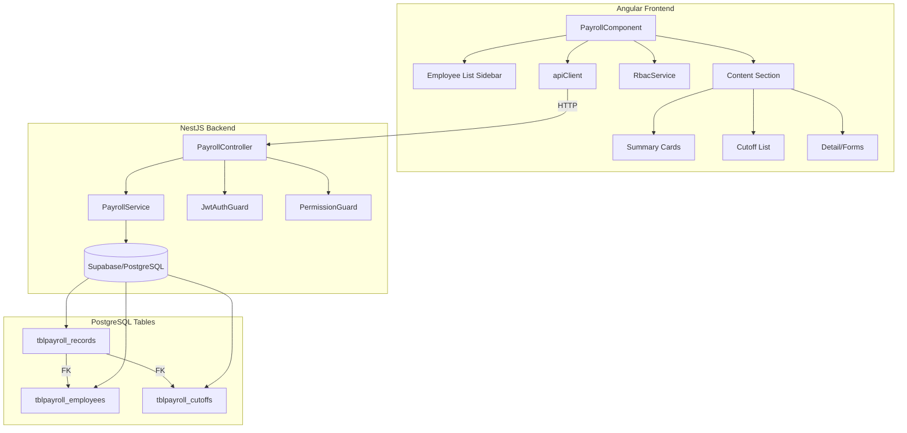
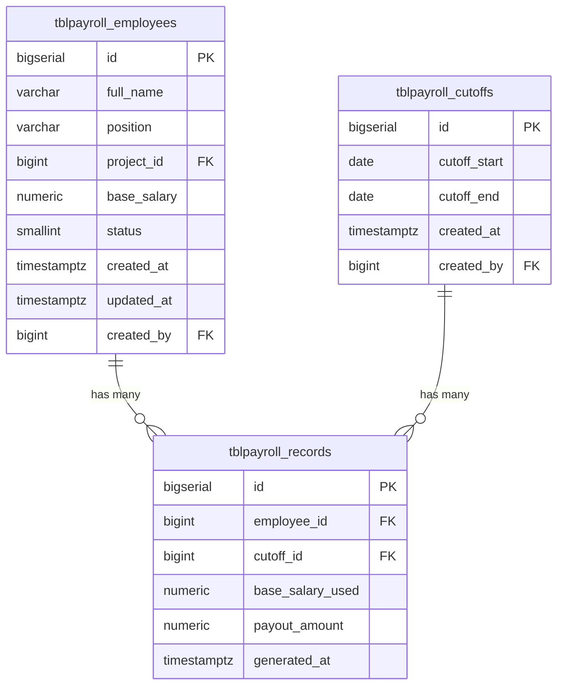

# Design Document: Payroll Module

## Overview

The Payroll Module adds employee payroll management capabilities to the Bagama HVAC system. It follows the established tree-view layout pattern (used by the Accounting module) with a sidebar employee list and a content section for payroll details. The module integrates with the existing RBAC system for permission-based access control and uses the same NestJS + Supabase/PostgreSQL backend architecture.

Key design decisions:
- **Reuse existing patterns**: The module mirrors the Accounting module's two-column grid layout, RBAC guard integration, and API response format (`{ success: boolean, data: unknown }`).
- **Standalone Angular component**: Following the project's convention of standalone components with inline imports (CommonModule, FormsModule).
- **Supabase direct queries**: The backend service uses the existing `DatabaseModule` and Supabase client for database operations, consistent with other modules.
- **Permission-based UI rendering**: UI elements (buttons, forms) are conditionally rendered based on the user's effective permission keys, using the existing `RbacService`.

## Architecture



### Request Flow

1. User navigates to `/payroll` route → Angular `rbacGuard` checks `payroll` menu access
2. `PayrollComponent` initializes → calls `GET /payroll/employees` via `apiClient`
3. User actions (create, edit, generate payroll) → guarded API calls with JWT
4. Backend `PermissionGuard` validates permission keys before controller logic executes
5. `PayrollService` performs Supabase queries and returns structured responses

## Components and Interfaces

### Frontend Components

**PayrollComponent** (standalone, route: `/payroll`)
- Two-column grid layout: sidebar (340px) + content area
- Manages state for: employee list, selected employee, filters, forms
- Imports: `CommonModule`, `FormsModule`, `PageBreadcrumbComponent`

### Backend Module Structure

```
backend/src/payroll/
├── payroll.module.ts        # NestJS module (imports DatabaseModule)
├── payroll.controller.ts    # REST endpoints with guards
├── payroll.service.ts       # Business logic and Supabase queries
└── dto/
    ├── create-employee.dto.ts
    ├── update-employee.dto.ts
    └── create-cutoff.dto.ts
```

### API Interfaces

```typescript
// GET /payroll/employees response
interface PayrollEmployee {
  id: number;
  fullName: string;
  position: string;
  projectId: number | null;
  projectName: string | null;
  baseSalary: number;
  status: number;
  createdAt: string;
}

// GET /payroll/employees/:id/summary response
interface PayrollEmployeeSummary {
  generatedPayrollCount: number;
  currentPayout: number;
  totalPayout: number;
}

// POST /payroll/employees body
interface CreateEmployeeDto {
  fullName: string;       // required, non-empty
  position: string;       // required, non-empty
  projectId?: number;     // optional, references projects table
  baseSalary: number;     // required, > 0
}

// PATCH /payroll/employees/:id body
interface UpdateEmployeeDto {
  fullName?: string;
  position?: string;
  projectId?: number | null;
  baseSalary?: number;
}

// POST /payroll/cutoffs body
interface CreateCutoffDto {
  cutoffStart: string;    // ISO date string, required
  cutoffEnd: string;      // ISO date string, required, must be >= cutoffStart
  employeeIds: number[];  // required, non-empty array
}

// GET /payroll/cutoffs/:id response
interface PayrollCutoffDetail {
  id: number;
  cutoffStart: string;
  cutoffEnd: string;
  createdAt: string;
  records: Array<{
    employeeId: number;
    employeeName: string;
    baseSalaryUsed: number;
    payoutAmount: number;
    generatedAt: string;
  }>;
}
```

### Controller Endpoints

| Method | Path | Permission | Description |
|--------|------|-----------|-------------|
| GET | `/payroll/employees` | `payroll.view` | List employees with optional filters |
| POST | `/payroll/employees` | `payroll.employee.create` | Create new employee |
| PATCH | `/payroll/employees/:id` | `payroll.employee.edit` | Update employee |
| GET | `/payroll/employees/:id/summary` | `payroll.view` | Get employee summary |
| GET | `/payroll/employees/:id/cutoffs` | `payroll.view` | Get employee cutoffs |
| POST | `/payroll/cutoffs` | `payroll.create` | Generate payroll for cutoff |
| GET | `/payroll/cutoffs/:id` | `payroll.cutoff.view` | Get cutoff details |

## Data Models

### Database Schema

```sql
-- Employee records
CREATE TABLE IF NOT EXISTS public.tblpayroll_employees (
  id BIGSERIAL PRIMARY KEY,
  full_name VARCHAR(255) NOT NULL,
  position VARCHAR(100) NOT NULL,
  project_id BIGINT REFERENCES public.tblprojects(id) ON DELETE SET NULL,
  base_salary NUMERIC(12,2) NOT NULL CHECK (base_salary > 0),
  status SMALLINT NOT NULL DEFAULT 1,
  created_at TIMESTAMPTZ NOT NULL DEFAULT NOW(),
  updated_at TIMESTAMPTZ,
  created_by BIGINT REFERENCES public.tblusers(id)
);

-- Payroll cutoff periods
CREATE TABLE IF NOT EXISTS public.tblpayroll_cutoffs (
  id BIGSERIAL PRIMARY KEY,
  cutoff_start DATE NOT NULL,
  cutoff_end DATE NOT NULL,
  created_at TIMESTAMPTZ NOT NULL DEFAULT NOW(),
  created_by BIGINT REFERENCES public.tblusers(id),
  CONSTRAINT chk_cutoff_dates CHECK (cutoff_end >= cutoff_start)
);

-- Individual payroll records (one per employee per cutoff)
CREATE TABLE IF NOT EXISTS public.tblpayroll_records (
  id BIGSERIAL PRIMARY KEY,
  employee_id BIGINT NOT NULL REFERENCES public.tblpayroll_employees(id) ON DELETE CASCADE,
  cutoff_id BIGINT NOT NULL REFERENCES public.tblpayroll_cutoffs(id) ON DELETE CASCADE,
  base_salary_used NUMERIC(12,2) NOT NULL,
  payout_amount NUMERIC(12,2) NOT NULL,
  generated_at TIMESTAMPTZ NOT NULL DEFAULT NOW(),
  CONSTRAINT uq_employee_cutoff UNIQUE (employee_id, cutoff_id)
);

-- Indexes for common queries
CREATE INDEX IF NOT EXISTS idx_payroll_records_employee ON public.tblpayroll_records(employee_id);
CREATE INDEX IF NOT EXISTS idx_payroll_records_cutoff ON public.tblpayroll_records(cutoff_id);
CREATE INDEX IF NOT EXISTS idx_payroll_employees_position ON public.tblpayroll_employees(position);
CREATE INDEX IF NOT EXISTS idx_payroll_employees_project ON public.tblpayroll_employees(project_id);
```

### RBAC Migration

```sql
-- Permission keys
INSERT INTO public.auth_permission_keys(key, label, module, scope) VALUES
  ('payroll.view', 'View Payroll', 'payroll', 'feature'),
  ('payroll.employee.create', 'Create Payroll Employee', 'payroll', 'action'),
  ('payroll.employee.edit', 'Edit Payroll Employee', 'payroll', 'action'),
  ('payroll.employee.delete', 'Delete Payroll Employee', 'payroll', 'action'),
  ('payroll.create', 'Create Payroll', 'payroll', 'action'),
  ('payroll.cutoff.view', 'View Payroll Cutoff', 'payroll', 'feature')
ON CONFLICT (key) DO NOTHING;

-- Menu entry
INSERT INTO public.auth_menus(key, label, route, icon, sort_order) VALUES
  ('payroll', 'Payroll', '/payroll', 'payments', 55)
ON CONFLICT (key) DO NOTHING;
```

### Entity Relationships



## Correctness Properties

*A property is a characteristic or behavior that should hold true across all valid executions of a system — essentially, a formal statement about what the system should do. Properties serve as the bridge between human-readable specifications and machine-verifiable correctness guarantees.*

### Property 1: Employee filtering correctness

*For any* employee list and any combination of position filter, project filter, and search term, the displayed employee list SHALL contain exactly those employees whose position matches the position filter (if set), whose project matches the project filter (if set), and whose full name contains the search term (if set).

**Validates: Requirements 2.3, 2.4, 2.5, 2.6, 3.3**

### Property 2: Employee creation round-trip

*For any* valid employee data (non-empty full name, non-empty position, positive base salary), creating an employee via POST and then retrieving it via GET SHALL return an employee record with equivalent field values.

**Validates: Requirements 4.2, 9.2**

### Property 3: Employee form validation rejects invalid input

*For any* employee form submission where at least one required field (full_name, position, base_salary) is missing or invalid (empty string, zero/negative salary), the system SHALL reject the submission and return validation errors.

**Validates: Requirements 4.3, 6.3**

### Property 4: Employee update round-trip

*For any* existing employee and any valid partial update (non-empty strings for name/position, positive number for salary), applying the update via PATCH and then retrieving the employee SHALL return a record reflecting the updated values while preserving unchanged fields.

**Validates: Requirements 6.2, 9.3**

### Property 5: Summary computation correctness

*For any* employee with N payroll records, the summary endpoint SHALL return: `generatedPayrollCount` equal to N, `currentPayout` equal to the payout_amount of the most recently generated record, and `totalPayout` equal to the sum of all payout_amount values.

**Validates: Requirements 5.3, 9.4**

### Property 6: Payroll generation correctness

*For any* valid cutoff period (start ≤ end) and non-empty set of active employees, generating payroll SHALL create exactly one payroll record per employee with `base_salary_used` equal to the employee's current `base_salary` and `payout_amount` equal to the computed amount based on the salary and cutoff period.

**Validates: Requirements 7.2, 7.3, 9.6**

### Property 7: Cutoff overlap rejection

*For any* employee who already has a payroll record for a cutoff period [A, B], attempting to generate a new payroll with a cutoff period [C, D] where the date ranges overlap (C ≤ B AND D ≥ A) for that same employee SHALL be rejected with an error.

**Validates: Requirements 7.4, 11.4**

### Property 8: Permission enforcement

*For any* protected payroll endpoint and any request from a user lacking the required permission key, the system SHALL return a 403 Forbidden response without executing the operation.

**Validates: Requirements 9.8**

### Property 9: Migration idempotency

*For any* number of executions of the payroll RBAC migration (1 or more), the resulting state of the `auth_permission_keys` and `auth_menus` tables SHALL be identical, with no duplicate entries or errors.

**Validates: Requirements 10.5**

### Property 10: Cutoff detail retrieval correctness

*For any* payroll cutoff with associated records, retrieving the cutoff details SHALL return the correct date range, all associated employee records with their base_salary_used and payout_amount, and the generation timestamp.

**Validates: Requirements 8.1, 9.7**

## Error Handling

### Backend Error Responses

| Scenario | HTTP Status | Response Body |
|----------|-------------|---------------|
| Missing/invalid JWT | 401 | `{ statusCode: 401, message: 'Unauthorized' }` |
| Insufficient permissions | 403 | `{ statusCode: 403, message: 'Access denied' }` |
| Employee not found | 404 | `{ success: false, message: 'Employee not found' }` |
| Cutoff not found | 404 | `{ success: false, message: 'Cutoff not found' }` |
| Validation failure | 400 | `{ success: false, message: '...', errors: [...] }` |
| Overlapping cutoff | 409 | `{ success: false, message: 'Cutoff period overlaps...' }` |
| Database error | 500 | `{ success: false, message: 'Internal server error' }` |

### Frontend Error Handling

- API errors are caught and displayed as inline error messages (matching the Accounting module pattern with `reportError` state)
- Form validation errors are displayed next to individual fields
- Network failures show a generic error notification via the existing notification service
- Permission-denied responses trigger a redirect to dashboard (consistent with `rbacGuard` behavior)

### Validation Rules

| Field | Rules |
|-------|-------|
| `full_name` | Required, non-empty after trim, max 255 chars |
| `position` | Required, non-empty after trim, max 100 chars |
| `base_salary` | Required, numeric, > 0 |
| `project_id` | Optional, must reference existing active project if provided |
| `cutoff_start` | Required, valid date |
| `cutoff_end` | Required, valid date, ≥ cutoff_start |
| `employeeIds` | Required, non-empty array of existing employee IDs |

## Testing Strategy

### Unit Tests (Example-Based)

- **Route guard tests**: Verify `rbacGuard` allows/denies access based on `payroll` menu key
- **Permission visibility tests**: Verify buttons are shown/hidden based on permission keys
- **Component rendering tests**: Verify layout structure, placeholder messages, form field presence
- **DTO validation tests**: Verify NestJS validation pipe rejects invalid payloads with correct error messages

### Property-Based Tests

Property-based testing is appropriate for this module because it contains pure business logic (filtering, summary computation, overlap detection, validation) with clear input/output behavior and a large input space.

**Library**: [fast-check](https://github.com/dubzzz/fast-check) (already available in the Node.js ecosystem, compatible with the project's test setup)

**Configuration**:
- Minimum 100 iterations per property test
- Each test tagged with: `Feature: payroll-module, Property {number}: {property_text}`

**Properties to implement**:
1. Employee filtering correctness (Property 1)
2. Employee creation round-trip (Property 2)
3. Employee form validation (Property 3)
4. Employee update round-trip (Property 4)
5. Summary computation correctness (Property 5)
6. Payroll generation correctness (Property 6)
7. Cutoff overlap rejection (Property 7)
8. Permission enforcement (Property 8)
9. Migration idempotency (Property 9)
10. Cutoff detail retrieval (Property 10)

### Integration Tests

- **Database schema tests**: Verify tables, constraints, and indexes exist after migration
- **RBAC migration tests**: Verify permission keys and menu entries are created correctly
- **End-to-end API tests**: Verify full request/response cycle with real database
- **Frontend E2E tests**: Verify user flows (add employee → generate payroll → view details)

### Smoke Tests

- Migration runs without errors on a fresh database
- All payroll tables exist with correct column types
- Permission keys exist in `auth_permission_keys` table
- Menu entry exists in `auth_menus` table
- Route `/payroll` is registered and accessible
