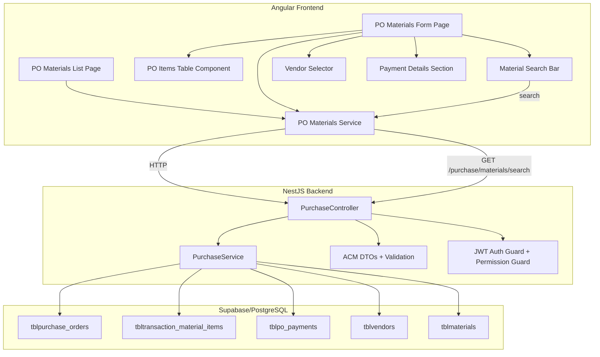
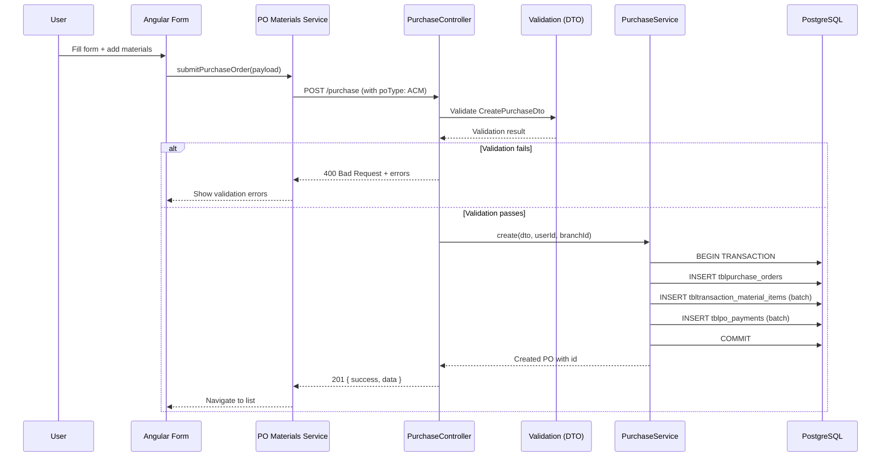
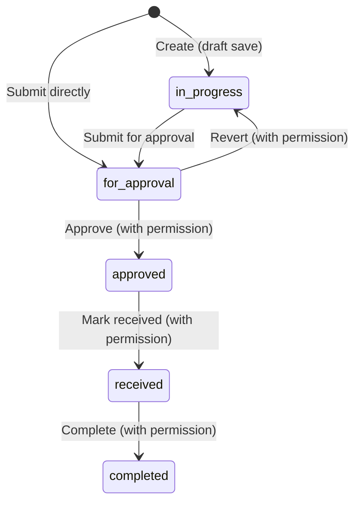

# Design Document: Purchase Order Materials (ACM)

## Overview

This design describes the redesigned Purchase Order Materials (ACM type) module, replacing the existing per-item brand/material dropdown drawer pattern with a dedicated form page that mirrors the Sales Order Materials UX. The new design features a global material search bar, an editable items table (ProductItemsTable pattern), vendor selection, payment details, and the existing PO approval workflow.

The implementation spans:
- **Frontend (Angular)**: A new `purchase-order-materials` page module with list view, form page, and reusable PO items table component
- **Backend (NestJS)**: Extended purchase service with ACM-specific endpoints, DTO validation, and status transition logic
- **Database (Supabase/PostgreSQL)**: Leverages existing `tblpurchase_orders`, `tbltransaction_material_items`, `tblpo_payments`, and `tblvendors` tables

### Key Design Decisions

1. **Reuse existing database tables** — The `tblpurchase_orders` table already supports `po_type = 'ACM'` and `tbltransaction_material_items` stores material line items linked to POs. No new tables are needed.
2. **Separate Angular page module** — Rather than modifying the existing complex `purchase-order` component (4500+ lines), a new `purchase-order-materials` page module provides a clean implementation following the SO Materials pattern.
3. **Shared ProductItemsTable pattern** — A PO-specific `PoItemsTableComponent` mirrors the existing `ProductItemsTableComponent` from SO Materials, adapted for PO fields (no `isNonInventory`, uses `discount` instead of flat rate).
4. **Backend reuse** — The existing `PurchaseService` and `PurchaseController` are extended with ACM-specific validation rather than creating a separate module, maintaining consistency with the current architecture.

## Architecture



### Request Flow



## Components and Interfaces

### Frontend Components

#### 1. PO Materials List Page (`po-materials-list.component.ts`)

Standalone Angular component displaying PO Materials orders in a tabbed list view.

```typescript
interface PoMaterialsListState {
  activeTab: 'my_requests' | 'deliveries' | 'approvals' | 'master_data';
  items: PurchaseOrderItem[];
  searchQuery: string;
  page: number;
  limit: number;
  totalPages: number;
  isLoading: boolean;
  error: string | null;
}
```

**Responsibilities:**
- Tab navigation with permission-based visibility
- Debounced search (500ms) filtering by PO number or vendor name
- Pagination (10 items/page)
- "New PO" button navigating to form page

#### 2. PO Materials Form Page (`po-materials-form.component.ts`)

Standalone Angular component for creating/editing ACM purchase orders.

```typescript
interface PoMaterialsFormState {
  mode: 'create' | 'edit';
  orderId?: number;
  orderStatus: string;
  isReadOnly: boolean;
  isSubmitting: boolean;
  validationError: string;

  // Vendor
  vendorMode: 'existing' | 'new';
  vendorSearch: string;
  vendorOptions: VendorOption[];
  selectedVendorId: string | null;
  vendorForm: { name: string; address: string; contact_person: string; contact_number: string };

  // Material Search
  materialSearchQuery: string;
  materialSearchResults: MaterialSearchResult[];
  isMaterialDropdownOpen: boolean;

  // Line Items
  productItems: PoLineItem[];

  // Payment
  paymentDetails: PoPaymentDetail[];

  // Remarks
  remarks: string;
}
```

#### 3. PO Items Table Component (`po-items-table.component.ts`)

Reusable standalone component following the `ProductItemsTableComponent` pattern.

```typescript
interface PoLineItem {
  materialId: number | null;
  description: string;
  itemCode: string | null;
  unit: string;
  cost: number;       // material unit_price (admin-only display)
  rate: number;       // editable unit price
  discount: number;   // editable discount amount per unit
  qty: number;        // editable quantity
  total: number;      // computed: max(rate - discount, 0) * qty
}

@Component({ selector: 'app-po-items-table', standalone: true })
export class PoItemsTableComponent {
  @Input() items: PoLineItem[] = [];
  @Input() isAdmin: boolean = false;
  @Input() isReadOnly: boolean = false;
  @Output() itemRemoved = new EventEmitter<number>();
  @Output() itemChanged = new EventEmitter<{ index: number; item: PoLineItem }>();

  // Validation: Rate 0.01–999999.99, Discount 0–999999.99, QTY 1–99999 (integer)
  // Total calculation: max((rate - discount), 0) * qty, rounded to 2 decimal places
  // Footer: sum of QTY, grand total (sum of all line totals)
}
```

#### 4. PO Materials Service (`po-materials.service.ts`)

Frontend service handling API communication.

```typescript
@Injectable({ providedIn: 'root' })
export class PoMaterialsService {
  // List endpoints (filtered to po_type = ACM)
  getMyRequests(params: PoQueryParams): Promise<PoListResult>;
  getDeliveries(params: PoQueryParams): Promise<PoListResult>;
  getApprovals(params: PoQueryParams): Promise<PoListResult>;
  getMasterData(params: PoQueryParams): Promise<PoListResult>;

  // CRUD
  createPurchaseOrder(payload: CreatePoMaterialsPayload): Promise<CreatePoResponse>;
  updatePurchaseOrder(id: number, payload: CreatePoMaterialsPayload): Promise<UpdatePoResponse>;
  getPurchaseOrderById(id: number): Promise<PoDetailResponse>;

  // Search
  searchMaterials(query: string): Promise<MaterialSearchResult[]>;
  searchVendors(query: string): Promise<VendorOption[]>;

  // Status transitions
  submitForApproval(id: number): Promise<ActionResponse>;
  approve(id: number): Promise<ActionResponse>;
  receive(id: number): Promise<ActionResponse>;
  complete(id: number): Promise<ActionResponse>;
  revertToInProgress(id: number): Promise<ActionResponse>;
}
```

### Backend Interfaces

#### 5. Extended Purchase Controller Endpoints

New/modified endpoints on the existing `PurchaseController`:

| Method | Path | Description |
|--------|------|-------------|
| POST | `/purchase` | Create PO (existing, enhanced with ACM validation) |
| PUT | `/purchase/:id` | Update PO (existing, enhanced with ACM validation) |
| GET | `/purchase/my-requests` | List user's POs (existing, filter by po_type) |
| GET | `/purchase/deliveries` | List deliveries (existing, filter by po_type) |
| GET | `/purchase/approvals` | List approvals (existing, filter by po_type) |
| GET | `/purchase/master-data` | List all (existing, filter by po_type) |
| GET | `/purchase/:id` | Get PO detail (existing) |
| GET | `/purchase/materials/search` | Search materials by name/code/brand |
| PUT | `/purchase/:id/revert-in-progress` | Revert to in-progress (existing) |
| PUT | `/purchase/:id/approve` | Approve PO (existing) |
| PUT | `/purchase/:id/verify-receive` | Mark as received (existing) |
| PUT | `/purchase/:id/receive-request` | Complete receive (existing) |

#### 6. ACM DTO Validation (`create-purchase.dto.ts` enhancement)

Enhanced validation for ACM-type POs applied within the existing `CreatePurchaseDto`:

```typescript
// Validation rules applied when poType === 'ACM':
// - productItems: non-empty array required
// - Each item must have materialName (non-empty) OR materialId
// - Each item.unitPrice: 0.01–999999.99
// - Each item.discountPrice: 0–999999.99
// - Each item.totalSetQty (qty): integer, 1–999999
// - vendorId OR vendor.name required
// - Error responses include field path of first invalid item
```

## Data Models

### Database Tables (Existing)

#### `tblpurchase_orders`
| Column | Type | Description |
|--------|------|-------------|
| id | SERIAL PK | Auto-increment ID |
| po_number | TEXT (generated) | `'PO-' || lpad(id::text, 6, '0')` |
| vendor_id | UUID FK | References tblvendors |
| total_amount | NUMERIC(12,2) | Sum of line item totals |
| status | TEXT | `in-progress`, `for_approval`, `approved`, `received`, `completed` |
| po_type | VARCHAR(20) | `ACU`, `ACP`, `ACM` |
| created_at | TIMESTAMPTZ | Creation timestamp |
| created_by | BIGINT FK | References tblusers |
| branchId | BIGINT FK | References tblbranches |
| approve_by | BIGINT | Approving user ID |
| approveDate | TIMESTAMPTZ | Approval timestamp |

#### `tbltransaction_material_items` (Line Items for ACM)
| Column | Type | Description |
|--------|------|-------------|
| id | BIGSERIAL PK | Auto-increment ID |
| trans_type | VARCHAR(20) | `'purchase'` for PO items |
| material_id | BIGINT FK | References tblmaterials |
| quantity | BIGINT | Item quantity |
| unit_price | NUMERIC(12,2) | Rate per unit |
| sell_price | NUMERIC(12,2) | Sell price (unused for PO) |
| discount_price | NUMERIC(12,2) | Discount amount per unit |
| purchase_id | INTEGER FK | References tblpurchase_orders |
| created_at | TIMESTAMPTZ | Creation timestamp |

#### `tblpo_payments`
| Column | Type | Description |
|--------|------|-------------|
| id | UUID PK | Auto-generated UUID |
| po_id | INTEGER FK | References tblpurchase_orders |
| method | TEXT | Payment method |
| terms | BIGINT | Payment terms in days |
| termsDueDate | VARCHAR | Due date |
| status | VARCHAR | `unpaid`, `paid`, `overdue` |
| paymentDate | VARCHAR | Payment date |
| downPayment | NUMERIC | Down payment amount |
| bank_name | TEXT | Bank name |
| reference_no | TEXT | Reference number |
| check_no | TEXT | Check number |
| cheque_date | TIMESTAMPTZ | Cheque date |
| issued_by | TEXT | Issued by |

#### `tblvendors`
| Column | Type | Description |
|--------|------|-------------|
| id | UUID PK | Auto-generated UUID |
| name | TEXT | Vendor name |
| address | TEXT | Vendor address |
| contact_person | TEXT | Contact person |
| contact_number | TEXT | Contact number |

#### `tblmaterials` (Search Source)
| Column | Type | Description |
|--------|------|-------------|
| id | BIGSERIAL PK | Material ID |
| brand_id | BIGINT FK | References tblbrands |
| material_name | TEXT | Material name |
| material_code | VARCHAR(50) | Unique code |
| unit | VARCHAR(20) | Unit of measure |
| unit_price | NUMERIC(12,2) | Cost price |
| sell_price | NUMERIC(12,2) | Selling price |

### Frontend Payload Interfaces

```typescript
interface CreatePoMaterialsPayload {
  poType: 'ACM';
  vendorId?: string;
  vendor?: { name: string; address?: string; contact_person?: string; contact_number?: string };
  productItems: Array<{
    transType: 'purchase';
    materialId?: number | null;
    materialName: string;
    materialCode?: string | null;
    materialUnit?: string;
    unitPrice: number;       // rate
    discountPrice: number;   // discount per unit
    totalSetQty: number;     // quantity
  }>;
  paymentDetails?: Array<{
    method: string;
    amount?: number;
    terms?: string;
    termsDueDate?: string | null;
    status?: string;
    paymentDate?: string | null;
    bankName?: string;
    referenceNo?: string;
    checkNo?: string;
    chequeDate?: string | null;
    issuedBy?: string;
    downPayment?: number;
  }>;
  remarks?: string;
  status: string;
}

interface MaterialSearchResult {
  id: number;
  material_name: string;
  material_code: string | null;
  unit: string;
  unit_price: number;
  sell_price: number;
  brand_name: string | null;
  product_type: string | null;
}
```

### Status Transition State Machine




## Correctness Properties

*A property is a characteristic or behavior that should hold true across all valid executions of a system — essentially, a formal statement about what the system should do. Properties serve as the bridge between human-readable specifications and machine-verifiable correctness guarantees.*

### Property 1: Tab filtering returns only ACM POs matching the selected status

*For any* dataset of purchase orders with mixed `po_type` values and statuses, selecting a tab SHALL return only items where `po_type = 'ACM'` AND the status matches the tab's status category.

**Validates: Requirements 1.2**

### Property 2: Search filtering matches PO number or vendor name

*For any* search query string and any dataset of ACM purchase orders, all returned results SHALL contain the search text as a case-insensitive substring of either the PO number or the vendor name.

**Validates: Requirements 1.3**

### Property 3: Pagination returns correct page slice

*For any* dataset of N items with page size 10, requesting page P SHALL return items at indices `[(P-1)*10, min(P*10, N))` and the total pages SHALL equal `ceil(N / 10)`.

**Validates: Requirements 1.5**

### Property 4: Material search returns relevant results

*For any* search query of 2+ characters and any dataset of materials, all returned results SHALL have the query as a case-insensitive substring of at least one of: material_name, material_code, product_type name, or brand_name. The result set SHALL contain at most 50 items.

**Validates: Requirements 2.1, 2.2**

### Property 5: Material selection maps correctly to line item fields

*For any* material from the search results, selecting it SHALL produce a line item where `description = material_name`, `itemCode = material_code`, `rate = unit_price`, `unit = unit`, and `qty = 1`.

**Validates: Requirements 2.3**

### Property 6: Duplicate material selection increments quantity

*For any* PO items table containing a line item with `materialId = X`, selecting a material with `id = X` from search results SHALL increment the existing line item's quantity by 1 and SHALL NOT add a new row to the table.

**Validates: Requirements 2.4**

### Property 7: Line item field validation accepts valid inputs and rejects invalid inputs

*For any* numeric value V: Rate is accepted if and only if `0.01 ≤ V ≤ 999999.99` with at most 2 decimal places; Discount is accepted if and only if `0 ≤ V ≤ 999999.99` with at most 2 decimal places; QTY is accepted if and only if V is an integer and `1 ≤ V ≤ 99999`. Invalid inputs SHALL be rejected and the field SHALL retain its previous valid value.

**Validates: Requirements 3.2, 3.3, 3.4, 3.9**

### Property 8: Line item total computation

*For any* line item with valid rate R, discount D, and quantity Q, the computed total SHALL equal `round(max(R - D, 0) * Q, 2)` (rounded to 2 decimal places).

**Validates: Requirements 3.5**

### Property 9: Footer computation is the sum of line items

*For any* list of line items (including empty list), the footer QTY SHALL equal the sum of all item quantities, and the grand total SHALL equal the sum of all item totals. After removing any item at index i, both footer values SHALL be recomputed from the remaining items.

**Validates: Requirements 3.6, 3.7**

### Property 10: Payment method determines visible fields

*For any* payment method selection, the set of visible fields SHALL match exactly the defined mapping: Cash → {amount, paymentDate}; Bank Transfer → {amount, bankName, referenceNo}; Terms → {amount, terms, termsDueDate}; Terms with DP → {amount, terms, termsDueDate, downPayment}; Cheque → {amount, bankName, checkNo, chequeDate, issuedBy}; Credit Card → {amount, paymentDate}; Installment → {amount, terms, termsDueDate, downPayment}.

**Validates: Requirements 5.2**

### Property 11: Payment status derived from method and due date

*For any* payment with method in {Terms, Terms with DP, Cheque, Installment} and a due date D, the payment status SHALL be "overdue" if D < today, otherwise "unpaid". For Cash or Bank Transfer, the status SHALL always be "paid".

**Validates: Requirements 5.3, 5.4**

### Property 12: Total amount computation on PO creation/update

*For any* set of line items, the stored `total_amount` SHALL equal the sum of each item's `(discount_price > 0 ? discount_price : unit_price) * quantity`, stored as NUMERIC(12,2).

**Validates: Requirements 6.7, 7.4**

### Property 13: PO data round-trip (save then load preserves data)

*For any* valid PO creation payload, creating the PO and then loading it by ID SHALL return data where vendor, line items (material, quantity, prices), payment details, and remarks match the original payload values.

**Validates: Requirements 7.1**

### Property 14: Status transition state machine

*For any* PO with current status S and requested transition action A, the transition SHALL succeed if and only if (S, A) is in the set of valid transitions: {(in-progress, submit) → for_approval, (for_approval, approve) → approved, (for_approval, revert) → in-progress, (approved, receive) → received, (received, complete) → completed}. All other (S, A) combinations SHALL be rejected without modifying the PO status.

**Validates: Requirements 8.1, 8.2, 8.3, 8.4, 8.5, 8.6, 8.7**

### Property 15: Non-editable status prevents updates

*For any* PO whose status is NOT "in-progress", an update request SHALL be rejected with an error message and the PO data SHALL remain unchanged.

**Validates: Requirements 7.3, 7.5**

### Property 16: Remarks trimming

*For any* string S provided as remarks, the persisted value SHALL equal `S.trim()`, and if `S.trim()` is empty (i.e., S was whitespace-only), the stored value SHALL be empty string.

**Validates: Requirements 9.3**

### Property 17: Backend DTO validation rejects invalid field values with field path

*For any* create/update PO request containing a line item with `unitPrice` outside [0.01, 999999.99], or `discountPrice` outside [0, 999999.99], or `qty` outside [1, 999999] or non-integer, or missing both `materialId` and non-empty `materialName`, the backend SHALL reject the request, persist no data, and include the field path of the first invalid item in the error response.

**Validates: Requirements 10.1, 10.2, 10.3, 10.4, 10.5, 10.6, 10.7, 10.8**

## Error Handling

### Frontend Error Handling

| Scenario | Behavior |
|----------|----------|
| API request fails (network/server error) | Display toast notification with error message; retain form state |
| Validation error on submit | Display inline validation message near the relevant field; prevent submission |
| Material search fails | Show "Search unavailable" in dropdown; allow manual retry |
| Vendor search fails | Show "Could not load vendors" message; allow retry |
| Load PO detail fails | Show error page with "Could not load order" and back button |
| Session token expired | Redirect to login page |

### Backend Error Handling

| Scenario | HTTP Status | Response |
|----------|-------------|----------|
| DTO validation failure | 400 | `{ success: false, message: "Validation error", errors: [...] }` |
| PO not found | 404 | `{ success: false, message: "Purchase order not found" }` |
| Invalid status transition | 400 | `{ success: false, message: "Cannot {action} from status {current}" }` |
| Unauthorized (no token) | 401 | `{ success: false, message: "Unauthorized" }` |
| Forbidden (no permission) | 403 | `{ success: false, message: "Insufficient permissions" }` |
| Database transaction failure | 500 | `{ success: false, message: "Internal server error" }` (rollback) |
| Vendor creation fails | 400 | `{ success: false, message: "Could not create vendor" }` |

### Transaction Safety

- All PO creation/update operations use database transactions
- If any step fails (PO insert, line items insert, payments insert), the entire transaction is rolled back
- No partial data is persisted on failure

## Testing Strategy

### Property-Based Tests (fast-check)

The project will use **fast-check** for property-based testing in TypeScript/JavaScript, configured with a minimum of 100 iterations per property.

**Target areas for PBT:**
- Line item total computation (Property 8)
- Footer/grand total computation (Property 9)
- Field validation logic (Property 7)
- Status transition state machine (Property 14)
- Payment status derivation (Property 11)
- Payment method → visible fields mapping (Property 10)
- Remarks trimming (Property 16)
- Backend DTO validation (Property 17)
- Total amount computation (Property 12)

Each property test will be tagged with:
```
// Feature: purchase-order-materials, Property {N}: {property_text}
```

### Unit Tests (Jest)

**Frontend unit tests:**
- Component rendering (tabs, columns, buttons)
- Admin vs non-admin Cost column visibility
- Read-only mode for non-editable statuses
- Material selection → line item creation
- Duplicate material → qty increment
- Payment method field visibility
- Form validation (empty items, missing vendor)
- Navigation on "New PO" click

**Backend unit tests:**
- DTO validation (valid and invalid payloads)
- Status transition logic (each valid transition + invalid attempts)
- Total amount computation
- Vendor upsert logic
- Remarks trimming
- PO number format verification

### Integration Tests

- Full PO creation flow (API → DB → response)
- PO update with line item replacement
- Status transition sequence (in-progress → completed)
- Material search endpoint with real database
- Vendor search and creation
- Transaction rollback on failure
- Permission-based access control

### Test Configuration

```json
{
  "testFramework": "jest",
  "pbtLibrary": "fast-check",
  "minIterations": 100,
  "coverageThreshold": {
    "branches": 80,
    "functions": 85,
    "lines": 85
  }
}
```
