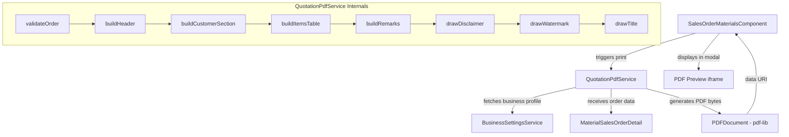

# Design Document: Quotation Print PDF

## Overview

This feature adds a dedicated "Print Quotation PDF" capability to the Material Sales Order module. When a Material Sales Order is in "Draft" status, sales staff can generate a PDF document formatted as a quotation — complete with business header, customer details, itemized materials table, remarks, and a prominent disclaimer footer. The PDF is generated entirely on the frontend using the `pdf-lib` library (already a project dependency) and rendered as a downloadable/previewable document.

The design extends the existing `PrintSalesOrderService` pattern, introducing a new `QuotationPdfService` that composes the PDF from scratch (no template dependency) and applies a "QUOTATION ONLY" watermark, a "QUOTATION" title, and a red italic disclaimer footer on every page.

### Key Design Decisions

1. **New dedicated service vs extending existing**: A new `QuotationPdfService` is introduced rather than extending `PrintSalesOrderService`. Rationale: the quotation PDF has a fundamentally different layout (business header, customer section, structured table with discount column, remarks, disclaimer) that doesn't align with the template-based approach of the existing print service.

2. **Frontend-only generation**: The PDF is composed entirely in the browser using `pdf-lib`. No backend endpoint is needed since all required data (order details, business profile) is already available through existing API calls.

3. **No external template PDF**: Unlike the existing sales order print which overlays text on a pre-designed PDF template, the quotation PDF builds the entire document programmatically. This gives full control over layout, pagination, and the disclaimer footer positioning.

4. **Standard fonts only**: Uses `pdf-lib` StandardFonts (Helvetica family) to avoid font embedding complexity. Italic is achieved via `StandardFonts.HelveticaOblique`.

## Architecture



The generation flow:
1. User clicks "Print Quotation" on a Draft order row
2. Component calls `SalesOrderMaterialService.getMaterialSalesOrderById()` to get full order detail
3. Component calls `BusinessSettingsService.getBusinessProfile()` to get header info
4. Component passes both to `QuotationPdfService.generateQuotationPdf()`
5. Service validates preconditions (Draft status, at least one item)
6. Service composes the PDF page-by-page and returns a base64 data URI
7. Component displays the PDF in an iframe modal for preview/download

## Components and Interfaces

### QuotationPdfService

```typescript
@Injectable({ providedIn: 'root' })
export class QuotationPdfService {
  /**
   * Generates a quotation PDF for a Material Sales Order.
   * @throws Error if order status is not 'draft' or has no product items.
   * @returns base64 data URI string for the generated PDF.
   */
  async generateQuotationPdf(
    order: MaterialSalesOrderDetail,
    businessProfile: BusinessProfileSettings | null,
  ): Promise<string>;
}
```

### QuotationPdfConfig (internal constants)

```typescript
interface QuotationPdfConfig {
  pageWidth: number;          // 595.28 (A4 points)
  pageHeight: number;         // 841.89 (A4 points)
  marginTop: number;          // 40
  marginBottom: number;       // 50
  marginLeft: number;         // 40
  marginRight: number;        // 40
  logoMaxHeight: number;      // 60
  disclaimerMinBottomSpacing: number; // 10
  watermarkOpacity: number;   // 0.08
  watermarkFontSize: number;  // 60
  watermarkRotation: number;  // -45 degrees
  headerFontSize: number;     // 10
  titleFontSize: number;      // 16
  bodyFontSize: number;       // 9
  tableFontSize: number;      // 9
  footerFontSize: number;     // 8
}
```

### Integration with Existing Components

The `SalesOrderMaterialsComponent` already has:
- `canPrintQuotation(status)` method that returns `true` for draft orders
- `onPrintQuotation(orderId, soNumber)` method that calls `generatePrintPreview()`
- Print preview modal with iframe

The existing `generatePrintPreview()` currently delegates to `PrintSalesOrderService` with a watermark option. The design will update `onPrintQuotation()` to use the new `QuotationPdfService` instead.

## Data Models

### Input Data (already existing)

**MaterialSalesOrderDetail** (from `sales-order-material.service.ts`):
```typescript
{
  id: number;
  soNumber: string | null;
  customerName: string | null;
  customerAddress: string | null;
  customerContactPerson: string | null;
  customerContactNumber: string | null;
  totalAmount: number;
  status: string;                    // must be 'draft'
  deliveryDate: string | null;
  scheduleDate: string | null;
  remarks: string | null;
  productItems: Array<{
    id: number;
    materialId: number | null;
    description: string;
    itemCode: string | null;
    brand: string | null;
    cost: number;
    rate: number;
    discount: number;
    qty: number;
    total: number;
    isNonInventory: boolean;
  }>;
}
```

**BusinessProfileSettings** (from `business-settings.service.ts`):
```typescript
{
  businessName: string | null;
  businessAddress: string | null;
  businessContact: string | null;
  businessEmail: string | null;
  businessLogo: string | null;       // URL to logo image
  businessLogoLight: string | null;
  businessLogoDark: string | null;
}
```

### Computed/Derived Values

| Value | Formula |
|-------|---------|
| Line Total | `max(0, rate - discount) × qty` |
| Grand Total | `sum(all line totals)` |
| Quotation Date | Current date at generation time, formatted "MMMM DD, YYYY" |
| Delivery Date | From order `deliveryDate` or `scheduleDate`, formatted "MMMM DD, YYYY" |
| Item Description Display | `description` + (if brand/itemCode non-empty: ` [brand - itemCode]`) |

### Monetary Formatting

All monetary values use `toLocaleString('en-US', { minimumFractionDigits: 2, maximumFractionDigits: 2 })` which provides exactly 2 decimal places with thousands separators (e.g., "1,234.56").


## Correctness Properties

*A property is a characteristic or behavior that should hold true across all valid executions of a system — essentially, a formal statement about what the system should do. Properties serve as the bridge between human-readable specifications and machine-verifiable correctness guarantees.*

### Property 1: Validation gate — only draft orders with items produce a PDF

*For any* `MaterialSalesOrderDetail` object, `generateQuotationPdf` SHALL succeed (return a valid PDF data URI) if and only if `status === 'draft'` AND `productItems.length >= 1`. For all other combinations, it SHALL throw an error.

**Validates: Requirements 1.1, 1.2, 1.3**

### Property 2: Line total calculation correctness

*For any* line item with `rate >= 0`, `discount >= 0`, and `qty >= 1`, the computed line total SHALL equal `Math.max(0, rate - discount) * qty`.

**Validates: Requirements 4.3**

### Property 3: Grand total is sum of line totals

*For any* set of line items, the grand total displayed in the PDF SHALL equal the sum of all individual line totals computed by the line total formula.

**Validates: Requirements 4.5**

### Property 4: Monetary formatting — 2 decimal places with thousands separators

*For any* non-negative number, the monetary format function SHALL produce a string with exactly 2 decimal digits and correct thousands separators (e.g., 1234.5 → "1,234.50").

**Validates: Requirements 4.4**

### Property 5: Date formatting produces "MMMM DD, YYYY" pattern

*For any* valid Date object, the date format function SHALL produce a string matching the pattern `<full month name> <zero-padded day>, <4-digit year>` (e.g., "June 14, 2026").

**Validates: Requirements 3.6, 3.7**

### Property 6: Null/empty field omission

*For any* `BusinessProfileSettings` or `MaterialSalesOrderDetail` where a displayable text field is `null`, `undefined`, or an empty string, the PDF generation process SHALL not draw that field's label or value — no blank labels or empty placeholders appear in the output draw calls.

**Validates: Requirements 2.7, 3.8**

### Property 7: Remarks conditional display

*For any* `remarks` string, the remarks section SHALL be included in the PDF if and only if the string contains at least one non-whitespace character. Strings that are `null`, empty, or contain only whitespace SHALL result in no remarks section being drawn.

**Validates: Requirements 7.1, 7.2**

### Property 8: Text wrapping — lines never exceed content width

*For any* text string and a given maximum width, the text wrapping function SHALL produce an array of lines where each line's rendered width (as measured by the font) is less than or equal to the maximum width.

**Validates: Requirements 7.3**

### Property 9: Logo scaling preserves aspect ratio within height constraint

*For any* image with `originalWidth > 0` and `originalHeight > 0`, the logo scaling function SHALL produce dimensions where `scaledHeight <= 60` and `scaledWidth / scaledHeight` equals `originalWidth / originalHeight` (within floating-point tolerance).

**Validates: Requirements 2.1**

### Property 10: Item order preservation

*For any* ordered list of line items passed to the PDF generator, the items SHALL appear in the rendered table rows in the same sequence as the input array (i.e., output index matches input index).

**Validates: Requirements 4.2**

### Property 11: Brand/item code conditional display

*For any* line item, the rendered description text SHALL include the brand and item code if and only if at least one of `brand` or `itemCode` is non-null and non-empty.

**Validates: Requirements 4.7**

## Error Handling

| Scenario | Behavior |
|----------|----------|
| Order status is not "draft" | `generateQuotationPdf()` throws an error with message: "Quotation prints are only available for Draft orders" |
| Order has zero product items | `generateQuotationPdf()` throws an error with message: "At least one product item is required" |
| Business profile is null | PDF is generated without the business header section (logo + text info omitted entirely) |
| Business logo URL fails to fetch | PDF is generated without the logo; text-based header info still renders |
| Logo image format is unsupported | PDF is generated without the logo (catch and skip) |
| Individual field is null/empty | Field is silently omitted from output |
| PDF generation fails (pdf-lib error) | Error propagates to component; component closes the modal and logs the error |

### Error Message Strategy

Validation errors are thrown as standard JavaScript `Error` objects. The calling component catches these and can display them via the existing notification or UI error pattern. No toast/snackbar library is needed since the component already handles error display.

## Testing Strategy

### Unit Tests (Jasmine)

- **Validation logic**: Verify error is thrown for non-draft status, for empty items
- **Date formatting**: Specific date inputs produce expected "MMMM DD, YYYY" output
- **Disclaimer content**: Verify exact disclaimer text string is used
- **Watermark configuration**: Verify opacity is within 0.05–0.15, rotation is ~45°, gray color
- **Table headers**: Verify column headers are drawn (item #, description, qty, rate, discount, total)
- **Title**: Verify "QUOTATION" title text is drawn
- **Logo absent handling**: When logo is null, PDF still generates successfully

### Property-Based Tests (fast-check)

The project already has `fast-check` (v3.22.0) as a dev dependency. Each property test runs a minimum of 100 iterations.

| Property | Test |
|----------|------|
| Property 1 | Generate random orders with random statuses and item counts; assert success iff draft + items |
| Property 2 | Generate random (rate, discount, qty) triples; assert `lineTotal === max(0, rate - discount) * qty` |
| Property 3 | Generate random arrays of line items; assert grandTotal === sum(lineTotals) |
| Property 4 | Generate random non-negative numbers; assert formatted string has exactly 2 decimal places and correct separators |
| Property 5 | Generate random valid dates; assert output matches "MMMM DD, YYYY" regex pattern |
| Property 6 | Generate business profiles and orders with random null/empty fields; assert no blank label strings in draw calls |
| Property 7 | Generate random strings (including whitespace-only); assert remarks drawn iff non-whitespace content exists |
| Property 8 | Generate random strings of varying lengths; assert all wrapped lines fit within max width |
| Property 9 | Generate random (width, height) pairs; assert scaled height ≤ 60 and aspect ratio preserved |
| Property 10 | Generate random item arrays; assert output indices match input indices |
| Property 11 | Generate items with random brand/itemCode combinations; assert description includes them only when present |

**Test Tag Format**: `Feature: quotation-print-pdf, Property {N}: {title}`

### Integration Tests

- End-to-end flow: Mock API responses, trigger print action on a draft order, verify PDF data URI is produced and iframe is populated
- Multi-page pagination: Create an order with 40+ items, verify PDF has multiple pages

### Testing Configuration

- Property tests: minimum 100 iterations each
- Test runner: Karma + Jasmine (existing project setup)
- PBT library: `fast-check` (already installed)
- Mocking: Business profile and order data are passed as parameters, no HTTP mocking needed for unit/property tests
