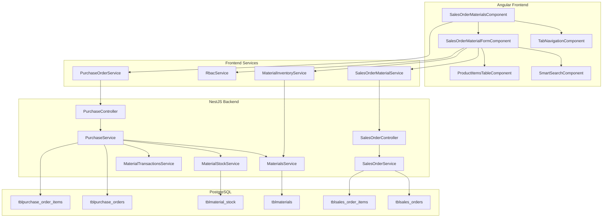

# Design Document: Sales Order Materials Module

## Overview

This design restructures the Sales Order module to focus on materials-based sales orders with a new tab-based lifecycle (Draft → Pending → Complete → Voided), a simplified creation form with smart material search, RBAC-controlled cost visibility, and non-inventory item support. It also extends the Purchase Order module to fully support ACM (Aircon Materials) product type workflows.

The system follows the existing Angular 19+ frontend with standalone components and a NestJS backend using PostgreSQL via the `DatabaseService` (raw SQL with `pg` PoolClient). The frontend uses a shared `RbacService` for role-based access control and `apiClient` (Axios) for HTTP communication.

### Key Design Decisions

1. **Reuse existing `sales-order-materials` page** as the primary module, extending it with tab structure and form capabilities rather than creating a new module.
2. **Leverage existing `MaterialInventoryService`** for smart search, extending the backend endpoint to support multi-field search.
3. **RBAC via `RbacService.isAdminOrSuperAdmin()`** — the existing method checks if the user's JWT `roleName` is "admin" or "superadmin".
4. **Non-inventory items stored in the same product items table** with a `is_non_inventory` boolean flag to distinguish them from catalog materials.
5. **Status-based tab filtering** handled by a new backend endpoint that accepts a `status` query parameter.

## Architecture



## Components and Interfaces

### Frontend Components

#### 1. SalesOrderMaterialsComponent (Container)
- **Responsibility**: Top-level page component managing tab navigation and list display.
- **Inputs**: Route parameters
- **Outputs**: Navigates to form component for create/edit

#### 2. TabNavigationComponent
- **Responsibility**: Renders the 4 status tabs (Draft, Pending, Complete, Voided) and emits tab change events.
- **Inputs**: `activeTab: SalesOrderStatus`
- **Outputs**: `tabChange: EventEmitter<SalesOrderStatus>`

#### 3. SalesOrderMaterialFormComponent
- **Responsibility**: The create/edit form for a materials sales order. Handles delivery date, customer selection, product items, and action buttons.
- **Inputs**: `orderId?: number` (for edit mode), `rbacService: RbacService`
- **Outputs**: Form submission events

#### 4. SmartSearchComponent
- **Responsibility**: Full-width search input with dropdown results for material lookup.
- **Inputs**: `placeholder: string`
- **Outputs**: `materialSelected: EventEmitter<Material>`, `nonInventoryRequested: EventEmitter<string>`

#### 5. ProductItemsTableComponent
- **Responsibility**: Displays line items with inline editing for Rate and QTY. Conditionally shows Cost column based on RBAC.
- **Inputs**: `items: LineItem[]`, `isAdmin: boolean`
- **Outputs**: `itemRemoved: EventEmitter<number>`, `itemChanged: EventEmitter<LineItem>`

### Frontend Interfaces

```typescript
type SalesOrderStatus = 'draft' | 'pending' | 'complete' | 'voided';

interface MaterialSearchResult {
  id: number;
  material_name: string;
  material_code: string | null;
  product_type: string;
  brand_name: string | null;
  unit: string;
  unit_price: number;  // cost
  sell_price: number;  // rate
}

interface LineItem {
  id?: number;
  itemNo: number;
  description: string;
  itemCode?: string | null;
  brand?: string | null;
  cost: number;         // unit_price from material
  rate: number;         // sell_price, editable
  qty: number;          // editable, integer 1-99999
  total: number;        // computed: rate * qty
  materialId?: number | null;
  isNonInventory: boolean;
}

interface CreateMaterialSalesOrderPayload {
  customer_id?: string | null;
  customer?: { name: string; address?: string; contact_person?: string; contact_number?: string };
  deliveryDate: string;       // ISO date string
  salesType: string;          // always "sales" for new orders
  status: 'draft' | 'pending';
  productItems: Array<{
    materialId?: number | null;
    description: string;
    itemCode?: string | null;
    brand?: string | null;
    cost: number;
    rate: number;
    qty: number;
    isNonInventory: boolean;
  }>;
  remarks?: string;
}

interface MaterialSalesOrderListParams {
  status: SalesOrderStatus;
  page: number;
  limit: number;
  search?: string;
}
```

### Backend API Endpoints

| Method | Endpoint | Description |
|--------|----------|-------------|
| GET | `/sales-order/materials` | List material sales orders by status (query: `status`, `page`, `limit`, `search`) |
| POST | `/sales-order/materials` | Create a new material sales order |
| PATCH | `/sales-order/materials/:id` | Update an existing material sales order |
| GET | `/sales-order/materials/:id` | Get a single material sales order detail |
| GET | `/inventory/materials/search` | Smart search materials (query: `q`, `limit`) |
| POST | `/purchase` | Create purchase order (existing, extended for ACM) |
| PATCH | `/purchase/:id` | Update purchase order (existing, extended for ACM) |

### Backend DTOs

```typescript
// CreateMaterialSalesOrderDto
class CreateMaterialSalesOrderDto {
  customer_id?: string;
  customer?: { name: string; address?: string; contact_person?: string; contact_number?: string };
  deliveryDate: string;       // ISO date, defaults to today
  salesType?: string;         // defaults to "sales"
  status: 'draft' | 'pending';
  productItems?: Array<{
    materialId?: number | null;
    description: string;
    itemCode?: string | null;
    brand?: string | null;
    cost: number;
    rate: number;
    qty: number;
    isNonInventory: boolean;
  }>;
  remarks?: string;
}

// MaterialSearchQueryDto
class MaterialSearchQueryDto {
  q: string;        // search term (min 1 char)
  limit?: number;   // max 50, default 50
}
```

## Data Models

### Sales Order Table Extension (`tblsales_orders`)

The existing table already has a `status` column. The materials module uses these status values:
- `'draft'` — Draft status
- `'pending'` — Pending status (finalized, printable)
- `'complete'` — Complete status (fulfilled, in reports)
- `'voided'` — Voided/cancelled

Additional column usage:
- `schedule_date` → used as delivery date (label change only, no schema change)
- `sales_type` → defaults to `'sales'` for new material orders
- `installer` → not populated by this module

### Sales Order Items Table Extension (`tblsales_order_items`)

New/repurposed columns for material line items:

| Column | Type | Description |
|--------|------|-------------|
| id | SERIAL PRIMARY KEY | Auto-increment ID |
| sales_order_id | INTEGER FK | Reference to parent sales order |
| material_id | INTEGER NULL | FK to tblmaterials (null for non-inventory) |
| description | VARCHAR(255) | Material name or non-inventory description |
| item_code | VARCHAR(100) NULL | Material code |
| brand | VARCHAR(100) NULL | Brand name |
| cost | DECIMAL(12,2) | Unit price (cost) |
| rate | DECIMAL(12,2) | Sell price (rate) |
| qty | INTEGER | Quantity (1-99999) |
| total | DECIMAL(12,2) | Computed: rate × qty |
| is_non_inventory | BOOLEAN DEFAULT FALSE | Flag for non-inventory items |
| created_at | TIMESTAMP | Creation timestamp |

### Materials Table (`tblmaterials`) — Existing

| Column | Type | Description |
|--------|------|-------------|
| id | SERIAL PRIMARY KEY | Material ID |
| brand_id | INTEGER NULL FK | FK to brands table |
| material_name | VARCHAR(255) | Product name |
| material_code | VARCHAR(100) NULL | Item code |
| description | TEXT NULL | Description |
| unit | VARCHAR(50) | Unit of measure |
| unit_price | DECIMAL(12,2) | Cost price |
| sell_price | DECIMAL(12,2) | Selling price |
| on_hand_stock | INTEGER | Current stock level |
| reorder_level | INTEGER | Reorder threshold |

### Purchase Order Items Extension for ACM

The existing `tblpurchase_order_items` table already supports `materialName`, `materialCode`, `materialUnit`, `materialBrandId`, `materialBrandName` columns (visible in `PurchaseOrderDetailProductItem` interface). The ACM flow uses these fields when `poType = 'ACM'`.

## Correctness Properties

*A property is a characteristic or behavior that should hold true across all valid executions of a system — essentially, a formal statement about what the system should do. Properties serve as the bridge between human-readable specifications and machine-verifiable correctness guarantees.*

### Property 1: Tab filtering shows only matching status orders

*For any* set of sales orders with mixed statuses and *for any* selected status tab, the displayed list SHALL contain only orders whose status matches the selected tab.

**Validates: Requirements 1.3, 1.4, 1.5, 1.6**

### Property 2: Print button visibility follows status rules

*For any* sales order, the print button SHALL be visible and enabled if and only if the order status is "pending" or "complete".

**Validates: Requirements 1.7, 1.8, 1.9**

### Property 3: Only complete orders are included in reports

*For any* set of sales orders, the report calculation SHALL include an order if and only if its status is "complete".

**Validates: Requirements 1.10**

### Property 4: Delivery date editability follows RBAC

*For any* user, the delivery date field SHALL be editable if and only if `RbacService.isAdminOrSuperAdmin()` returns true for that user.

**Validates: Requirements 2.3, 2.4**

### Property 5: New orders always have salesType "sales"

*For any* new sales order created through this module, the persisted `salesType` value SHALL equal the string "sales".

**Validates: Requirements 3.2, 3.4**

### Property 6: Editing preserves original salesType

*For any* existing sales order with a salesType value other than "sales", updating that order through this module SHALL preserve the original salesType value unchanged.

**Validates: Requirements 3.3**

### Property 7: Installer property is never included in payloads

*For any* create or update operation performed through this module, the request payload SHALL NOT contain an `installer` property.

**Validates: Requirements 4.3, 4.4**

### Property 8: Smart search returns relevant results capped at 50

*For any* search query of 1 or more characters and *for any* materials catalog, the search results SHALL contain only materials matching by product name, item code, product type, or brand, and the result count SHALL NOT exceed 50.

**Validates: Requirements 5.2**

### Property 9: Material selection populates row correctly

*For any* material selected from search results, the new line item row SHALL have description equal to the material's name, item_code equal to the material's code, brand equal to the material's brand, cost equal to unit_price, rate equal to sell_price, and qty equal to 1.

**Validates: Requirements 5.3**

### Property 10: Selecting an existing material creates a new row

*For any* material that already exists as a line item in the product items table, selecting it again from search SHALL increase the total row count by exactly 1 without modifying any existing row.

**Validates: Requirements 5.5**

### Property 11: Line item total calculation

*For any* line item (inventory or non-inventory) with rate R and quantity Q, the total SHALL equal `round(R × Q, 2)`.

**Validates: Requirements 6.5, 9.4**

### Property 12: Table totals invariant

*For any* set of line items in the product items table, the Grand_Total SHALL equal `round(sum(item.total for all items), 2)` and Total_QTY SHALL equal `sum(item.qty for all items)`. This invariant SHALL hold after any add or remove operation.

**Validates: Requirements 6.8, 6.9, 6.10, 9.5**

### Property 13: QTY validation bounds

*For any* QTY input value, the system SHALL accept it if and only if it is a whole number in the range [1, 99999].

**Validates: Requirements 6.6**

### Property 14: Rate validation bounds

*For any* Rate input value, the system SHALL accept it if and only if it is a number with at most 2 decimal places in the range [0.01, 999999.99].

**Validates: Requirements 6.7**

### Property 15: Draft save succeeds without product items

*For any* valid form state (with or without product items), clicking "Save as Draft" SHALL successfully persist the order with status "draft".

**Validates: Requirements 7.2**

### Property 16: Create Order saves with pending status

*For any* valid form state with at least one product item, clicking "Create Order" SHALL persist the order with status "pending".

**Validates: Requirements 7.3**

### Property 17: Form data retention on server error

*For any* form state and *for any* server error response, all user-entered form data SHALL remain unchanged after the error is displayed.

**Validates: Requirements 7.5**

### Property 18: ACM PO requires material name and quantity

*For any* ACM purchase order payload, the system SHALL reject submission if material name is empty or quantity is not provided, and SHALL accept submission when both are present.

**Validates: Requirements 8.3**

### Property 19: ACM completion increases stock

*For any* ACM purchase order that transitions to completed status with quantity Q for material M, the material's `on_hand_stock` SHALL increase by exactly Q.

**Validates: Requirements 8.4**

### Property 20: ACM auto-creates non-existent materials

*For any* material specified in an ACM purchase order that does not exist in the materials catalog, the system SHALL create a new material record with the provided brand, name, code, and unit before saving the purchase order line.

**Validates: Requirements 8.6**

### Property 21: Non-inventory item description length

*For any* non-inventory item description, the system SHALL accept it if and only if its length is between 1 and 255 characters (inclusive).

**Validates: Requirements 9.1**

### Property 22: Non-inventory items persist with flag

*For any* non-inventory line item saved in a sales order, the persisted record SHALL have `is_non_inventory = true`.

**Validates: Requirements 9.6**

## Error Handling

### Frontend Error Handling

| Scenario | Behavior |
|----------|----------|
| Network timeout / server unreachable | Display toast notification "Unable to connect to server. Please try again." Retain form data. |
| 400 Bad Request (validation error) | Display specific validation messages from server response next to relevant fields. |
| 401 Unauthorized | Redirect to login page via existing auth interceptor. |
| 403 Forbidden | Display "You do not have permission to perform this action." |
| 404 Not Found (order/material) | Display "Record not found" and redirect to list view. |
| 500 Internal Server Error | Display generic "An unexpected error occurred. Please try again later." Retain form data. |
| Smart search returns empty | Show "No materials found" message with option to add as non-inventory item. |
| Duplicate submission prevention | Disable action buttons during save; re-enable on response (success or error). |

### Backend Error Handling

| Scenario | HTTP Status | Response |
|----------|-------------|----------|
| Missing required fields | 400 | `{ success: false, message: "Validation failed", errors: [...] }` |
| Invalid status transition | 400 | `{ success: false, message: "Invalid status transition from X to Y" }` |
| Order not found | 404 | `{ success: false, message: "Sales order not found" }` |
| Material not found (for stock update) | 404 | `{ success: false, message: "Material not found" }` |
| Database constraint violation | 409 | `{ success: false, message: "Conflict: ..." }` |
| Unexpected error | 500 | `{ success: false, message: "Internal server error" }` |

### Validation Rules Summary

| Field | Rule | Error Message |
|-------|------|---------------|
| QTY | Integer, 1–99999 | "Quantity must be a whole number between 1 and 99,999" |
| Rate | Numeric, 0.01–999999.99, max 2 decimals | "Rate must be between 0.01 and 999,999.99" |
| Non-inventory description | 1–255 characters | "Description must be between 1 and 255 characters" |
| Product items (Create Order) | At least 1 item required | "At least one product item is required" |
| Delivery Date | Valid date, defaults to today | "Invalid delivery date" |
| ACM material name | Required when poType=ACM | "Material name is required" |
| ACM quantity | Required, 1–999999 | "Quantity is required and must be between 1 and 999,999" |

## Testing Strategy

### Unit Tests (Example-Based)

Unit tests cover specific scenarios, UI rendering checks, and edge cases:

- **Tab rendering**: Verify exactly 4 tabs in correct order (Req 1.1)
- **Default tab selection**: Verify Draft tab is active on load (Req 1.2)
- **Delivery Date label**: Verify label reads "Delivery Date" (Req 2.1)
- **Delivery Date default**: Verify defaults to current date (Req 2.2)
- **Non-admin date reset**: Verify date resets to today for non-admin (Req 2.5)
- **Sales Type field absence**: Verify no Sales Type field in create/edit forms (Req 3.1)
- **Installer field absence**: Verify no Installer field in forms (Req 4.1, 4.2)
- **Search input layout**: Verify full-width search above table (Req 5.1)
- **No results handling**: Verify no-results indication and non-inventory option (Req 5.4)
- **Table columns**: Verify correct column headers (Req 6.1)
- **Inline editing**: Verify Rate and QTY are editable (Req 6.4)
- **Action buttons**: Verify both buttons exist (Req 7.1)
- **Empty table validation**: Verify Create Order blocked with no items (Req 7.4)
- **Success message**: Verify success toast appears after save (Req 7.6)
- **ACM product type option**: Verify ACM is selectable (Req 8.1)
- **ACM fields display**: Verify material fields appear when ACM selected (Req 8.2)
- **Non-inventory validation**: Verify rejection of Rate=0 or empty QTY (Req 9.3)

### Property-Based Tests

Property-based tests verify universal properties across generated inputs. Each test runs a minimum of 100 iterations.

**Library**: [fast-check](https://github.com/dubzzz/fast-check) (already compatible with the project's TypeScript/Jest setup)

**Configuration**: Each property test runs with `{ numRuns: 100 }` minimum.

**Tag format**: `Feature: sales-order-materials-module, Property {number}: {property_text}`

Properties to implement:
1. Tab filtering (Property 1)
2. Print button visibility (Property 2)
3. Report inclusion (Property 3)
4. Delivery date RBAC (Property 4)
5. SalesType default (Property 5)
6. SalesType preservation (Property 6)
7. Installer omission (Property 7)
8. Smart search relevance (Property 8)
9. Material selection population (Property 9)
10. Duplicate material new row (Property 10)
11. Line item total calculation (Property 11)
12. Table totals invariant (Property 12)
13. QTY validation (Property 13)
14. Rate validation (Property 14)
15. Draft save without items (Property 15)
16. Create Order pending status (Property 16)
17. Form data retention on error (Property 17)
18. ACM PO validation (Property 18)
19. ACM stock movement (Property 19)
20. ACM auto-create material (Property 20)
21. Non-inventory description length (Property 21)
22. Non-inventory flag persistence (Property 22)

### Integration Tests

- End-to-end flow: Create draft → Edit → Finalize to pending → Complete → Verify in reports
- ACM purchase order: Create → Complete → Verify stock movement
- Smart search: Verify backend search endpoint returns correct results
- RBAC: Verify admin vs non-admin behavior for delivery date and cost column
- Non-inventory: Create order with mixed inventory/non-inventory items → Verify persistence
